<!-- ============================================ -->
<!-- Game Guide Club — Home (Magazine Issue)     -->
<!-- ============================================ -->

<!-- ==================== -->
<!-- COVER STORY          -->
<!-- ==================== -->

  

  

    
✨ Cover Story

    <h1 class="mag-cover-title">The Ultimate Game Guide Hub</h1>
    
Factory automation, survival building, strategy — complete guides, interactive tools, and game databases under one roof.

    <a href="#games" class="mag-cover-cta">
      Browse Games
      ↓
    </a>
    

      📊 10+ Games
      🔧 6 Interactive Tools
      📰 4 Featured Articles
    

  

<!-- ==================== -->
<!-- FEATURED ARTICLES     -->
<!-- ==================== -->

  <h2>Latest Articles</h2>
  <a href="news/" class="mag-section-link">View All →</a>

  <a href="news/posts/2026-07-05-valheim-bog-witch-update/" class="mag-article-card">
    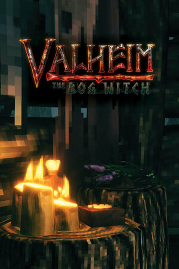
    

      
🎮 Update Deep Dive

      <h3>Valheim Bog Witch — Everything New in the Big Content Update</h3>
      
New biome mechanics, boss strategies, and a complete guide to the Bog Witch content drop.

      

        📅 Jul 5, 2026
        📖 8 min read
      

    

  </a>

  <a href="news/posts/2026-07-05-satisfactory-1-0-meta/" class="mag-article-card">
    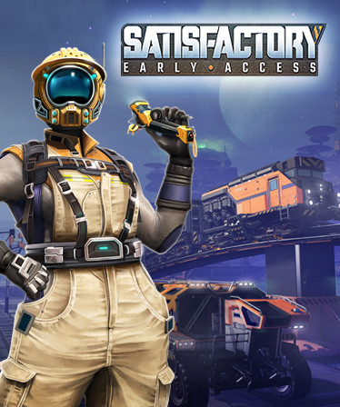
    

      
⚙️ Meta Analysis

      <h3>Satisfactory 1.0 — How the Meta Has Evolved</h3>
      
From early access to full release — production chains, power systems, and the new endgame.

      

        📅 Jul 5, 2026
        📖 10 min read
      

    

  </a>

  <a href="news/posts/2026-07-05-factorio-space-age-retrospective/" class="mag-article-card">
    
    

      
🚀 Retrospective

      <h3>Factorio Space Age — One Year In Review</h3>
      
A deep look at how Space Age changed the Factorio landscape — from interplanetary logistics to quality modules.

      

        📅 Jul 5, 2026
        📖 12 min read
      

    

  </a>

  <a href="news/posts/2026-07-05-enshrouded-horizons-update/" class="mag-article-card">
    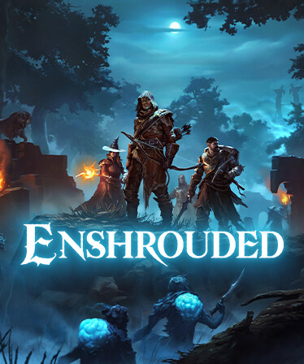
    

      
🔥 Update Guide

      <h3>Enshrouded Horizons — New Biome, Weapons & Build System</h3>
      
Everything you need to know about the Horizons update — new enemies, gear progression, and base building improvements.

      

        📅 Jul 5, 2026
        📖 9 min read
      

    

  </a>

<!-- ==================== -->
<!-- INTERACTIVE TOOLS     -->
<!-- ==================== -->

  <h2>Interactive Tools</h2>
  <a href="tools/" class="mag-section-link">All Tools →</a>

  <a href="tools/production-calculator/" class="mag-tool-card">
    🧮
    
      Production Calculator
      Ratios & throughput
    
  </a>
  <a href="tools/power-planner/" class="mag-tool-card">
    ⚡
    
      Power Grid Planner
      Energy management
    
  </a>
  <a href="tools/factory-planner/" class="mag-tool-card">
    🔧
    
      Factory Planner
      Layout & design
    
  </a>
  <a href="tools/game-map/" class="mag-tool-card">
    🗺️
    
      Game Map Reference
      Biome & resource maps
    
  </a>
  <a href="tools/boss-tracker/" class="mag-tool-card">
    ⚔️
    
      Boss Tracker
      Valheim bosses
    
  </a>

<!-- ==================== -->
<!-- FACTORY GAMES         -->
<!-- ==================== -->

  
🏭

  

    <h3>Factory Automation</h3>
    
Build, optimize, automate — the best factory games

  

  <a href="satisfactory/" class="mag-game-card mag-game-factory">
    
    

      ⚙️ Satisfactory
      
3D first-person factory builder with exploration

      9 guides
    

  </a>

  <a href="factorio/" class="mag-game-card mag-game-factory">
    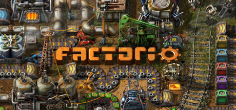
    

      💡 Factorio
      
The gold standard of factory automation

      7 guides
    

  </a>

  <a href="dyson/" class="mag-game-card mag-game-factory">
    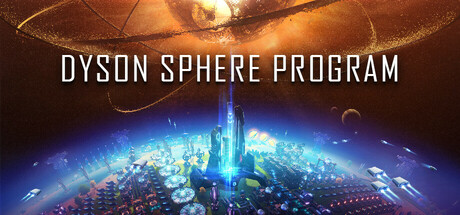
    

      🌌 Dyson Sphere Program
      
Interstellar factory simulation

      6 guides
    

  </a>

  <a href="timberborn/" class="mag-game-card mag-game-factory">
    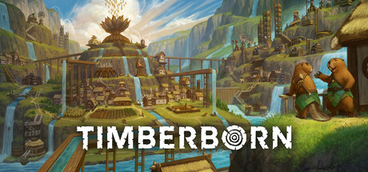
    

      🌿 Timberborn
      
Beaver-powered colony survival

      7 guides
    

  </a>

  <a href="shapez2/" class="mag-game-card mag-game-factory">
    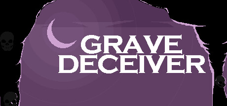
    

      ⬡ Shapez 2
      
Pure logistics puzzle optimization

      6 guides
    

  </a>

<!-- ==================== -->
<!-- SURVIVAL & BUILDING   -->
<!-- ==================== -->

  
🌍

  

    <h3>Survival & Building</h3>
    
Explore, craft, build — open-world survival at its best

  

  <a href="valheim/" class="mag-game-card mag-game-survival">
    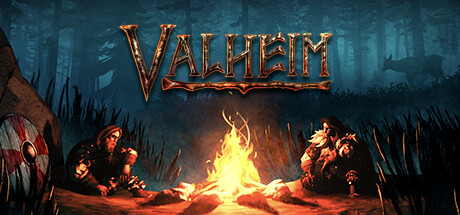
    

      ⚔️ Valheim
      
Viking survival with epic boss fights

      8 guides
    

  </a>

  <a href="enshrouded/" class="mag-game-card mag-game-survival">
    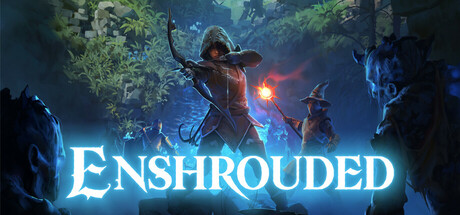
    

      🔥 Enshrouded
      
Action survival in a fantasy wasteland

      5 guides
    

  </a>

  <a href="vrising/" class="mag-game-card mag-game-survival">
    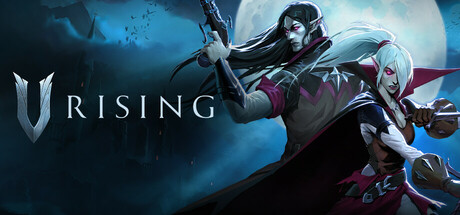
    

      🩸 V Rising
      
Vampire survival with castle building

      6 guides
    

  </a>

  <a href="sons-forest/" class="mag-game-card mag-game-survival">
    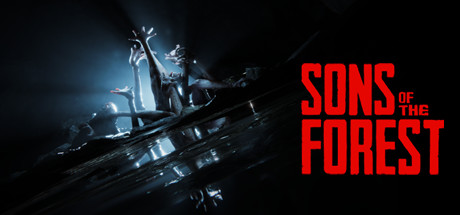
    

      🌲 Sons of the Forest
      
Horror survival on a remote island

      3 guides
    

  </a>

  <a href="grounded/" class="mag-game-card mag-game-survival">
    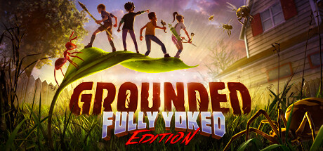
    

      🐞 Grounded
      
Shrunken survival in a backyard

      3 guides
    

  </a>

<!-- ==================== -->
<!-- GAME COMPARISON       -->
<!-- ==================== -->

  <h2>Which Game Fits You?</h2>
  <a href="games/comparison/" class="mag-section-link">Compare All →</a>

  <a href="games/comparison/" class="mag-tool-card">
    📊
    
      Game Comparison
      Find your next obsession
    
  </a>
  <a href="games/comparison/?tag=factory" class="mag-tool-card">
    🏭
    
      Best Factory Games
      Top automation picks
    
  </a>
  <a href="games/comparison/?tag=survival" class="mag-tool-card">
    🌿
    
      Best Survival Games
      Top survival picks
    
  </a>

<!-- ==================== -->
<!-- FEEDBACK              -->
<!-- ==================== -->

  <h2>📬 Got a Request?</h2>
  
Missing a guide? Want a tool for a specific game? Let us know — we build what the community needs.

  <a href="feedback/" class="hero-cta">
    Submit Feedback
    →
  </a>

