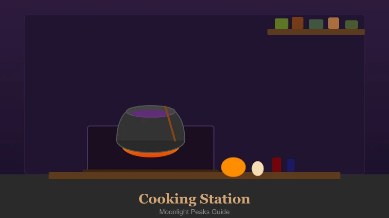
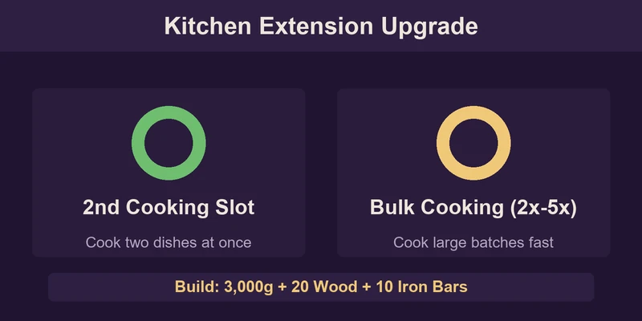
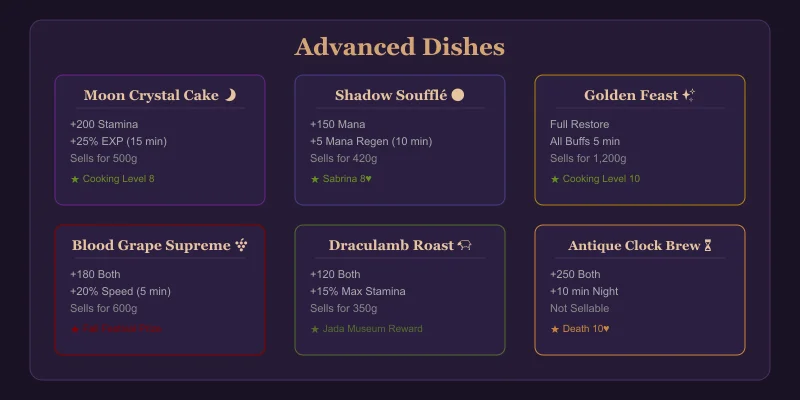
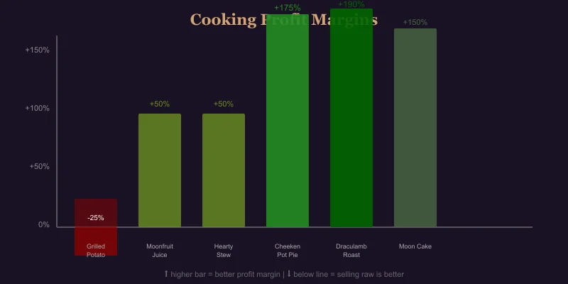

# Moonlight Peaks: Complete Cooking & Recipes Guide

Cooking turns raw ingredients into powerful meals that restore Stamina and Mana, grant buffs, and can be more profitable than selling ingredients raw. This guide covers every recipe, ingredient source, and the best dishes for every stage of the game.

## How Cooking Works

Unlock cooking by completing **"The Hungry Heart"** quest (early Summer Y1, talk to Sabrina after repairing your wand). She gives you a basic Cauldron — place it on your farm.

1. **Gather ingredients** from crops, foraging, fishing, animal products
2. **Interact with the Cauldron** to see available recipes
3. **Select a recipe** — if you have the ingredients, it auto-cooks
4. **New recipes** are learned from NPCs, quest rewards, and exploring

As you upgrade your home, you can build a **Kitchen Extension** (3,000g + 20 Wood + 10 Iron Bars) which unlocks a second cooking slot and the ability to cook in bulk (2x-5x batches).

---

## All Recipes

### ⭐ Basic Recipes (No Kitchen Required)

| Recipe | Ingredients | Effect | Sell Price | Source |
|--------|-------------|--------|------------|--------|
| Grilled Wild Potato | 2 Wild Potato | +30 Stamina | 30g | Default |
| Herb Tea | 3 Any Herb | +20 Mana | 25g | "The Hungry Heart" quest |
| Moonfruit Juice | 1 Moonfruit | +40 Stamina | 45g | Default |
| Simple Salad | 2 Any Veg + 1 Any Herb | +50 Stamina | 55g | Reach Farming 2 |
| Toasted Pumpkin Seeds | 1 Pumpkin Seeds | +25 Stamina | 15g | Forage near Ridge's shop |

### 🍲 Intermediate Recipes (Requires Cauldron)

| Recipe | Ingredients | Effect | Sell Price | Buff | Learn From |
|--------|-------------|--------|------------|------|------------|
| Hearty Stew | 2 Potato + 1 Carrot + 1 Any Meat | +100 Stamina | 120g | — | Sabrina (3 hearts) |
| Mana Bisque | 1 Nightshade + 1 Any Fish + 1 Milk | +80 Mana | 150g | +2 Mana Regen (5 min) | Sabrina (5 hearts) |
| Vampire's Delight | 1 Blood Grape + 1 Any Meat + 1 Garlic | +60 Both | 200g | +10% Speed (3 min) | Orlock (wine quest reward) |
| Stuffed Gobbler | 1 Gobbler + 1 Herb + 1 Berry | +150 Stamina | 280g | — | Cooking Level 5 |
| Cheeken Pot Pie | 1 Cheeken Egg + 1 Wheat + 1 Any Veg | +90 Stamina | 110g | +1 Defense (5 min) | Luna (4 hearts) |
| Draculamb Roast | 1 Draculamb Milk + 1 Any Meat + 2 Herbs | +120 Both | 350g | +15% Max Stamina (10 min) | Jada (museum reward) |

### ✨ Advanced Recipes (Requires Kitchen Extension)

| Recipe | Ingredients | Effect | Sell Price | Buff | Learn From |
|--------|-------------|--------|------------|------|------------|
| Moon Crystal Cake | 1 Moon Crystal + 2 Wheat + 1 Egg + 1 Butter | +200 Stamina | 500g | +25% EXP (15 min) | Cooking Level 8 |
| Shadow Soufflé | 1 Nightshade + 1 Mana Essence + 2 Eggs | +150 Mana | 420g | +5 Mana Regen (10 min) | Sabrina (8 hearts) |
| Blood Grape Supreme | 3 Blood Grape + 1 Sugar + 1 Any Fruit | +180 Both | 600g | +20% Speed (5 min) | Festival prize (Fall) |
| Golden Feast | 1 Golden Egg + 1 Diamond Dust + 2 Any S+ Crop | Full restore | 1,200g | All buffs (5 min) | Cooking Level 10 |
| Antique Clock Brew | 10 Soul Blobs + 5 Moon Crystal + 3 Gold Bar | +250 Both | — | +10 min night (one use) | Death (10 hearts) |

---

## Best Dishes by Category

### 🏃 Best for Stamina Recovery

| Stage | Best Dish | Cost to Make | Stamina per g |
|-------|-----------|-------------|---------------|
| Early | Grilled Wild Potato (2 Potato) | 40g crops | 0.75/g |
| Mid | Hearty Stew | ~100g crops | 1.0/g |
| Late | Moon Crystal Cake | ~200g | 1.0/g |
| Emergency | Golden Feast | Rare mats | Full restore |

### 🔮 Best for Mana Recovery

| Stage | Best Dish | Cost to Make | Mana per g |
|-------|-----------|-------------|------------|
| Early | Herb Tea (3 Herb) | Free (forage) | ∞ |
| Mid | Mana Bisque | ~80g | 1.0/g |
| Late | Shadow Soufflé | ~200g | 0.75/g |

### 💰 Best for Profit (Cooking vs Selling Raw)

| Recipe | Ingredient Value (sold raw) | Cooked Value | Profit Boost |
|--------|---------------------------|--------------|--------------|
| Grilled Wild Potato | 2 × 20g = 40g | 30g | ❌ -25% |
| Moonfruit Juice | 1 × 30g = 30g | 45g | ✅ +50% |
| Hearty Stew | ~80g ingredients | 120g | ✅ +50% |
| Cheeken Pot Pie | ~40g ingredients | 110g | ✅ +175% |
| Draculamb Roast | ~120g ingredients | 350g | ✅ +190% |
| Moon Crystal Cake | ~200g ingredients | 500g | ✅ +150% |

> **Tip:** Never sell Grilled Wild Potato — raw potatoes sell for more. Always process Cheeken Eggs into Pot Pie for best early profit.

---

## Ingredients Reference

### Vegetable Crops
| Ingredient | Source | Season | Best Use |
|-----------|--------|--------|----------|
| Wild Potato | Crop (Spring) | Spring | Early stamina |
| Carrot | Crop (Spring) | Spring | Hearty Stew |
| Pumpkin | Crop (Fall) | Fall | Niche recipes |
| Blackberry | Crop (Winter) | Winter | Desserts |

### Herbs & Forage
| Ingredient | Source | Best Use |
|-----------|--------|----------|
| Nightshade | Forage (caves, dark areas) | Mana dishes |
| Moonfruit | Forage (Moonlit Pines) | Juice, desserts |
| Any Herb | Forage (fields, forest) | Tea, salads |
| Garlic | Forage (Abandoned Mine) | Vampire's Delight |

### Animal Products
| Ingredient | Source | Cost | Best Use |
|-----------|--------|------|----------|
| Cheeken Egg | Cheeken (Barn) | 2 days per egg | Pot Pie, cakes |
| Milk | Pig Goat (Barn) | Daily | Bisque, soufflé |
| Draculamb Milk | Draculamb (Barn) | Daily (premium) | Roast, golden dishes |
| Golden Egg | Rare drop (happy Cheeken) | Very rare | Golden Feast |

### Special Ingredients
| Ingredient | How to Get |
|-----------|-----------|
| Mana Essence | Mana Extractor from magical crops |
| Moon Crystal | Mining (deep levels), geodes |
| Soul Blob | Bug catching (night only) |
| Diamond Dust | Processing Diamond at Mill |
| Sugar | Mill processing Sugarbones |

---

## Cooking Skill Levels

| Level | Unlock | Bonus |
|-------|--------|-------|
| 1 | Basic Cauldron | — |
| 2 | Simple Salad recipe | +5% Stamina from food |
| 3 | Bulk cook (2x) | — |
| 4 | Hearty Stew recipe | Recipes sell for +10% |
| 5 | Stuffed Gobbler recipe | +10% Mana from food |
| 6 | Kitchen Extension plan | — |
| 7 | Bulk cook (5x) | — |
| 8 | Moon Crystal Cake recipe | +10% buff duration |
| 9 | Shadow Soufflé recipe | Recipes sell for +20% |
| 10 | Golden Feast recipe | All dishes restore +20% |

Gain cooking XP by making any dish. Hearty stews and complex dishes give more XP than simple ones.

---

## Cooking Tips & Tricks

1. **Grow a variety.** Don't just plant one crop — you need diversity for recipes. Keep 3-5 of each crop type before selling.
2. **Herb garden.** Dedicate a small 3x3 plot to herbs (forage seeds from wild herbs). Herb Tea is free Mana.
3. **Barn before kitchen.** Get a Barn (4,000g) and at least one Cheeken before investing in the Kitchen Extension — eggs enable your best early profit dishes.
4. **Mana Bisque for mining.** Before a deep mining run, eat Mana Bisque for +2 Mana Regen — it pays for itself in ore.
5. **Save Moon Crystals.** Don't sell all of them — Moon Crystal Cake is the best EXP booster for mid-game skill grinding.
6. **Festival cooking.** Enter the Fall Harvest Festival cooking competition with a Blood Grape Supreme or Draculamb Roast for an easy win.
7. **Soul Blob Brew.** The Antique Clock Brew (from Death at 10 hearts) extends your night by 10 minutes — invaluable for late-game farm management.
