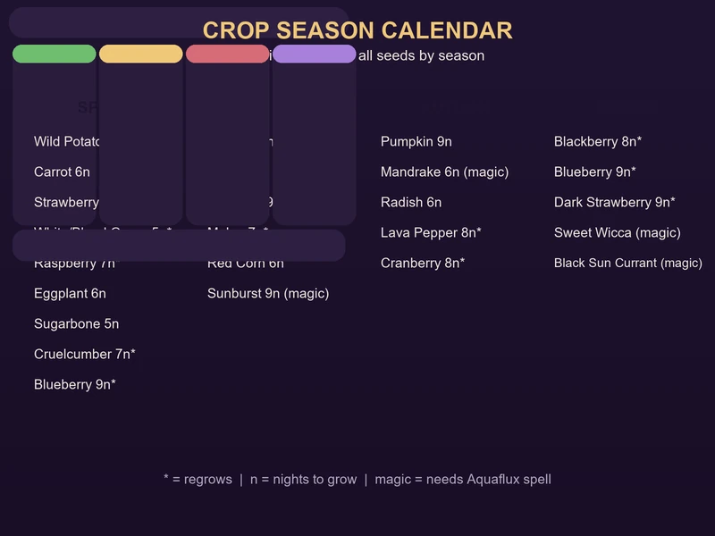
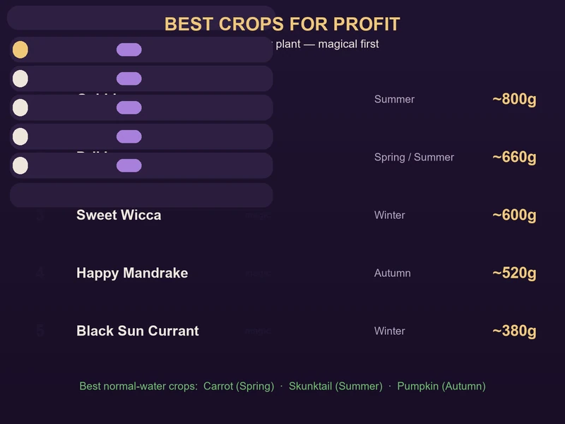
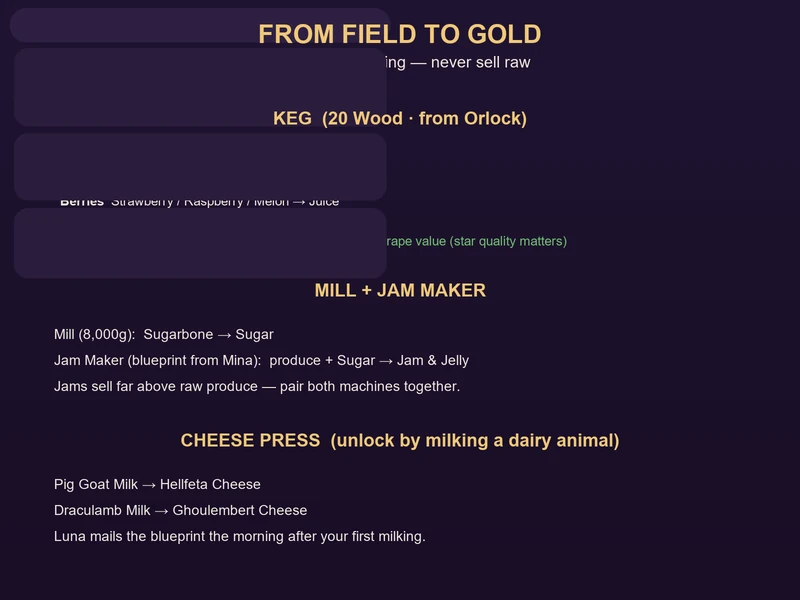
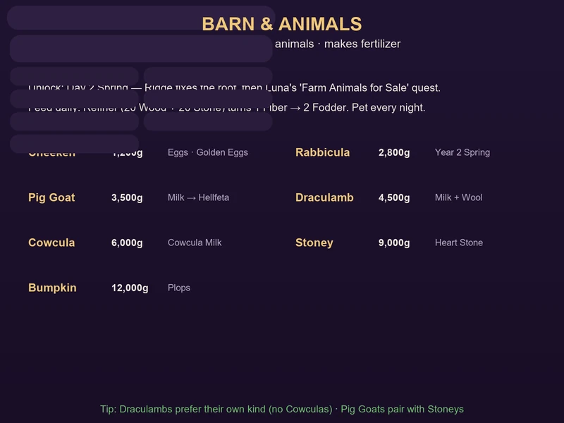

# Moonlight Peaks: Complete Crop & Farming Guide

Farming is the heart of Moonlight Peaks. Almost everything in the game — money, cooking, gifting, potions, and the museum — flows from what you grow on your little vampire farm. With **50+ seeds** across four seasons (plus mushrooms, herbs and fruit trees), the game gives you a lot to juggle. This guide covers every crop, how farming actually works, which seeds are worth your coins, and how to turn a harvest into real money.

---

## Farming Basics

The loop is simple: **plow with a shovel, plant a seed, water it, harvest**. But a few systems quietly change how you plan.

1. **Plow & plant** — use a shovel on open soil, then place a seed from your inventory. Clear logs with the axe and long grass with the scythe first.
2. **Water every night** — most crops need the watering can daily (or the **Aquaflux** spell once you unlock magic). Miss a day and the crop just stalls.
3. **Scarecrows are mandatory** — birds will eat unprotected crops. Build enough scarecrows to cover your field, and you stop losing harvests.
4. **Watch the moon** — during a **Full Moon**, all crops grow **50% faster**, so it's the best night to plant high-value seeds. A **New Moon** boosts ghost/shadow-aligned crops while slowing light-aligned ones.
5. **Magical crops need magic water** — regular crops take the watering can, but **magical crops require the Aquaflux Spell** (a watering can won't work). You unlock it in Summer of Year 1 through the "The Magic of Crops" quest.
6. **Fertilizer** — once you own a Barn, your animals produce fertilizer. Apply it to tilled soil before planting to raise crop quality (star level), which raises the selling price of raw produce *and* anything you process from it.

### Trees & Herbs (a different game)

- **Fruit trees** don't need watering at all. Plant a tree seed, wait ~25 nights for it to mature, then it produces fruit every few nights forever. They're a long-term investment — the best pure-profit play once your field is stable.
- **Herbs** must be planted in a dedicated **Herb Garden**, not basic soil. They're mostly used for potions and cooking, and most need the Aquaflux spell.

> 💡 **Golden rule:** before you sell anything new, keep **1–2 of each item** on hand. You never know when a recipe, quest, or the museum will demand it.

---

## Complete Seed List by Season

All seeds come from **Luna's Seed Stall** in Moonlit Pines, and her stock rotates with the season. Growth times are listed in **nights** (one in-game night). A ⭯ marks a crop that **regrows** after harvesting — you don't need to replant.

### 🌙 All-Season Crops (grow year-round)

| Crop | Seed | Growth | Regrows | Notes |
|------|:----:|:------:|:-------:|-------|
| Onion | 10g | 4 | No | Cheapest starter crop; great late-season filler |
| Blood Tomato | 20g | 6 | No | Used in Gazpacho Soup |
| Wily Wheat | 30g | 4 | No | Fast; turns into Beer in the Keg for real money |
| Moonfruit ⚡ | 100g | 6 | No | Magical; yields 3× per harvest; best processed into Moonfruit Jam |

### 🌸 Spring Crops

| Crop | Seed | Growth | Regrows | Notes |
|------|:----:|:------:|:-------:|-------|
| Wild Potato | 20g | 3 | No | Best early cash crop — fast, cheap, reliable |
| Raspberry | 20g | 7 | ⭯ every 2 | Great regrower; Keg it |
| White Grape | 20g | 5 | ⭯ every 4 | Spring+Summer; make White Wine |
| Blood Grape | 20g | 5 | ⭯ every 4 | Spring+Summer; make Red Wine |
| Blueberry | 20g | 9 | ⭯ every 3 | Spring+Winter; Keg it |
| Strawberry | 30g | 7 | ⭯ every 3 | Spring+Summer; best processed into Strawberry Juice |
| Cruelcumber | 30g | 7 | No | Mid-tier normal crop |
| Eggplant | 40g | 6 | No | Used in Farmer's Stew |
| Sugarbone | 60g | 5 | No | Run through the Mill for Sugar |
| Carrot | 80g | 6 | No | Best direct-sale Spring crop (~160g+) |
| Rice | 30g | 5 | No | Spring/Summer/Autumn |
| Drikker ⚡ | 280g | 9 | No | Magical; Spring+Summer — see best crops below |

### ☀️ Summer Crops

| Crop | Seed | Growth | Regrows | Notes |
|------|:----:|:------:|:-------:|-------|
| Red Corn | 40g | 6 | No | Summer+Autumn |
| Melon | 40g | 7 | ⭯ every 6 | Summer+Autumn; juice base |
| Skunktail | 80g | 9 | No | Best normal-water Summer crop (sells ~180g) |
| Sunburst ⚡ | 140g | 9 | No | Magical; Summer+Autumn |
| Drikker ⚡ | 280g | 9 | No | Magical; Spring+Summer — big profit — see best crops below |
| Gobbler ⚡ | 350g | 6 | No | Magical; **best crop in the game** — feed each plant a fish or bug while it grows |
| Rice | 30g | 5 | No | Spring/Summer/Autumn |

### 🍂 Autumn Crops

| Crop | Seed | Growth | Regrows | Notes |
|------|:----:|:------:|:-------:|-------|
| Radish | 20g | 6 | No | Cheap, solid returns |
| Lava Pepper | 30g | 8 | ⭯ every 2 | Fast regrower; recipes |
| Cranberry | 50g | 8 | ⭯ every 4 | Autumn+Winter; Keg it |
| Pumpkin | 90g | 9 | No | Best normal-water Autumn crop (~220g); gifts & recipes |
| Mandrake ⚡ | 200g | 6 | No | Magical; Happy Mandrake is a top profit crop |
| Rice | 30g | 5 | No | Spring/Summer/Autumn |

### ❄️ Winter Crops

| Crop | Seed | Growth | Regrows | Notes |
|------|:----:|:------:|:-------:|-------|
| Blackberry | — | 8 | ⭯ every 2 | Best normal-water Winter crop |
| Blueberry | 20g | 9 | ⭯ every 3 | Spring+Winter; Keg it |
| Dark Strawberry ⚡ | — | 9 | ⭯ every 3 | Magical; profitable in the Keg |
| Sweet Wicca ⚡ | — | — | No | Magical; plant near Hold-Me-Close to make |
| Black Sun Currant ⚡ | — | 12 | ⭯ | Magical; strong regrowing Mana crop |

*⚡ = requires the Aquaflux spell to water.*

### 🍄 Mushrooms, Herbs & Fruit Trees

**Mushroom spores** (plant in soil, no Aquaflux unless noted):

| Spore | Seed | Season | Notes |
|-------|:----:|:------:|-------|
| Amanita | 10g | Summer/Autumn | — |
| Common Mushroom | 10g | Summer/Autumn | — |
| Glowhammer | 20g | Summer/Winter | Instant growth |
| Volacio ⚡ | 20g | Summer/Winter | Instant growth; needs Aquaflux |
| Yellow Glowhammer ⚡ | 20g | Summer | Instant growth; needs Aquaflux |

**Herbs** (must be planted in an Herb Garden; most need Aquaflux):

| Herb | Seed | Season | Growth |
|------|:----:|:------:|:------:|
| Googly Garlic ⚡ | 120g | Spring/Summer/Autumn | 3 |
| Nightshade ⚡ | 140g | All | 4 |
| Wolfsbane ⚡ | — | All | 8 |

**Fruit trees** (no watering; ~25 nights to mature, then produce forever):

| Tree | Seed | Fruit every |
|------|:----:|:-----------:|
| Lemon Tree | 2,000g | 6 nights |
| Blood Orange Tree | 3,000g | 7 nights |
| Coffee Bean Tree | 4,500g | 7 nights |
| Cocoa Bean Tree | 4,500g | 8 nights |
| Muse Tree | 6,000g | 7 nights (place a Gramophone nearby) |

---

## Best Crops for Profit

Not all seeds are equal. If you only remember a few, remember these:

| Rank | Crop | Season | Profit per plant |
|:----:|------|:------:|:----------------:|
| 🥇 | **Gobbler** ⚡ | Summer | ~800g |
| 🥈 | **Drikker** ⚡ | Spring/Summer | ~660g |
| 🥉 | **Sweet Wicca** ⚡ | Winter | ~600g |
| 4 | **Happy Mandrake** ⚡ | Autumn | ~520g |
| 5 | **Black Sun Currant** ⚡ | Winter | ~380g |

**For normal-water players**, the best direct-sellers are: **Carrot** (Spring, ~160g+), **Skunktail** (Summer, ~180g), and **Pumpkin** (Autumn, ~220g). The best normal *regrowers* are Grapes and Strawberry (Spring/Summer) — they keep producing all season and are exactly what your Kegs want.

> 💡 **The big insight:** the *real* money in Moonlight Peaks is never selling raw crops. It's processing them (below). A single Gobbler is nice — a Keg full of Wine is how you buy a Barn.

---

## Processing: Turn Crops into Gold

Raw produce sells for pocket change. Processed goods sell for multiples. This is the single most important economic system in the game.

### 🛢️ Keg (20 Wood, blueprint from Orlock)

- Build **at least 3 Kegs** so you can process multiple harvests at once.
- **Wine:** Red Wine = **4 Blood Grapes** → ~360g (390g at 1-star). White Wine = **4 White Grapes** → ~460g (490g at 1-star). **White Wine outsells Red**, so favor White Grapes early.
- **Mana Wine** (later): 2 White Grapes + 2 Blood Grapes + 1 Mana Essence → roughly **3× the price of Red Wine**. One of the best money-makers in the game.
- **Beer:** **3 Wily Wheat** → ~420g (520g at 1-star). An easy early money-maker once you can grow Wily Wheat.
- **Juice:** Strawberries, Raspberries and Melons turn into juices — they sell for less than wine but your regrowers produce faster, so you can build stock quickly and turn it over in days.
- Wine profit ranges **8–17×** the raw grape value depending on star quality — the higher the star of your produce, the more the Keg pays.

### 🍓 Jam Maker (blueprint from Mina, later in the game)

- Turns produce + **Sugar** into Jams and Jellies at a higher price.
- Jams need **Sugar**, which only unlocks once you have the **Mill**.

### ⚙️ Mill (8,000g)

- Turns **Sugarbone** into Sugar, which feeds the Jam Maker (and high-end recipes).
- It's a big early investment, but it's the key to the jam economy.

### 🧀 Cheese Press (unlock by milking a dairy animal)

- The first time you milk a **Pig Goat** or **Draculamb**, Luna mails you the Cheese Press blueprint the next morning.
- **Pig Goat Milk → Hellfeta Cheese**, **Draculamb Milk → Ghoulembert Cheese** — big price jumps over raw milk.

> 💡 **Processing rule of thumb:** raw sale → Keg or Jam Maker → way more money. Run Kegs and Jam Makers together so almost every harvest hits max value. Fertilizer from your Barn raises the star quality of everything in the chain.

---

## Animals & the Barn

### Building the Barn

- **Unlock:** Day 2 of Spring, **Ridge** repairs your roof (50 Wood), and Luna sends the "Farm Animals for Sale" letter. Once the roof is done (around Day 4), you can buy a Barn.
- **Cost:** **4,000g** from Ridge at the Howling Hammer. Needs a cleared **10×6 space** and takes one night to build.
- **Capacity:** each Barn holds **4 animals**. Barns can't be upgraded, so you'll buy more as your menagerie grows. Barns also produce collectible **fertilizer**.

### All Animals (bought from Luna's Farm)

Luna has **three animals available each day**, rotating daily (including color variants). Before you build a Barn, you'll only see Cheekens.

| Animal | Cost | Produces | Notes |
|--------|:----:|----------|-------|
| **Cheeken** | 1,200g | Eggs, Golden Eggs | Starter animal; eggs cook into fast stamina |
| **Rabbicula** | 2,800g | — | Year 2 Spring |
| **Pig Goat** | 3,500g | Pig Goat Milk | Milk → Hellfeta in the Cheese Press |
| **Draculamb** | 4,500g | Milk, Wool | Milk → Ghoulembert; wool for crafting |
| **Cowcula** | 6,000g | Cowcula Milk | Later-game dairy |
| **Stoney** | 9,000g | Heart Stone | Winter Year 1 |
| **Bumpkin** | 12,000g | Plops | Fall Year 1 |

### Feeding & Care

- **Fodder:** fill the barn trough daily. Craft Fodder in a **Refiner** (blueprint unlocks after the roof repair; costs 20 Wood + 20 Stone). Put **Fiber** (from weeds/bushes with the scythe) into the Refiner — **1 Fiber = 2 Fodder**.
- **Pet them daily** — this raises happiness and product quality (e.g., Golden Eggs). Talking to animals in **Hellkitten form** lets you understand their needs and can replace petting.
- **Play music** — a Gramophone nearby boosts animal mood.
- **Watch the pairings:** some animals dislike sharing a barn. **Draculambs** prefer only other Draculambs (no Cowculas); **Pig Goats** pair well with Stoneys. You'll want at least three Barns to keep one of every species happy.
- ⚠️ **Draculambs eat red flowers** — keep red flowers away from your Beehives or honey production drops.

> 💡 **Barn first, animals second:** the Barn pays for itself as soon as it starts producing fertilizer, because fertilizer is what turns your normal crops into high-star produce (and high-star Wine/Jam).

---

## Pro Tips & FAQ

**Q: What should I plant on night one?**
Wild Potatoes. They grow in 3 nights, cost almost nothing, and get you liquid cash while you chase the early quests.

**Q: How many crops should I plant?**
More than you can water is wasted. Start with a **6×6 field** and expand as your tools and Mana improve. A smaller field you can keep fully watered beats a huge one that stalls.

**Q: When is the best time to plant expensive seeds?**
On a **Full Moon** — everything grows 50% faster, so expensive seeds pay off sooner.

**Q: What's the best long-term money maker?**
Grapes → Wine in the Keg, backed by fruit trees (which need no upkeep at all). Add fertilizer for star quality and you have a self-sustaining economy.

**Q: Do I need every crop?**
Keep **one 2-star version of each crop** — the **Museum** wants them for its collection rooms. Save one of everything before you sell or process the rest.

---

## Related Guides

- [🆕 Beginner's Guide](beginners-guide.md) — first 10 nights step by step
- [💰 Money Making Guide](money-making.md) — stage-by-stage profit strategy
- [🔮 Vampire Powers & Spells](vampire-powers.md) — the Aquaflux spell and magic system
- [⛏️ Mining & Cave of Echoes](mining-caves.md) — ore, smelting and pickaxes
- [🍳 Cooking & Recipes](cooking-recipes.md) — turn your harvest into meals
- [🌙 完全攻略指南](index.md) — the Moonlight Peaks hub

---

*Guide prepared for game-guide.club. Game version: Moonlight Peaks 1.0 (July 2026 release). Updated 2026-08-16.*
