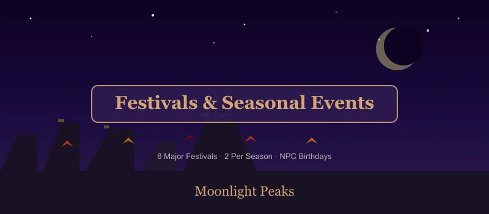
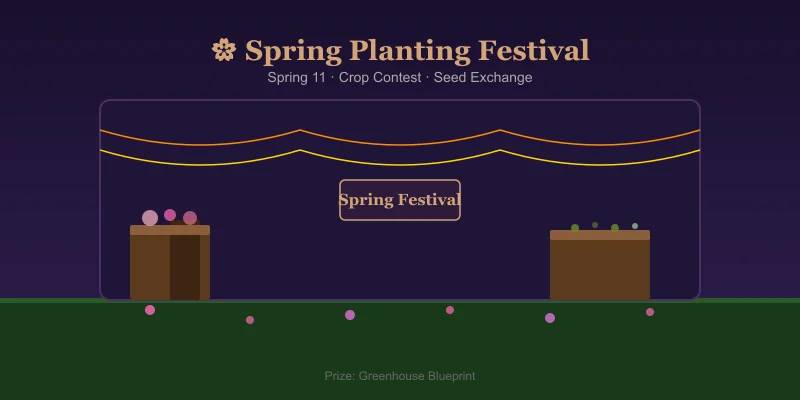
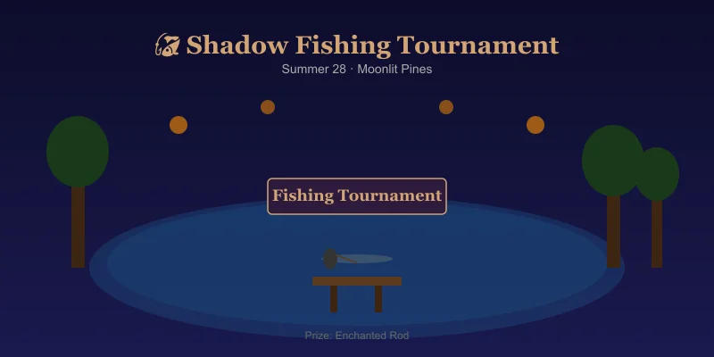
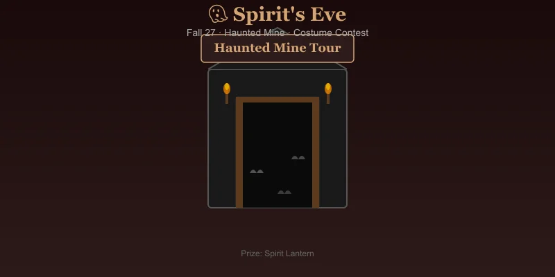
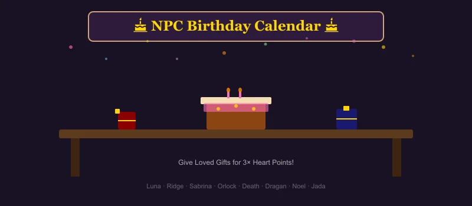

# Moonlight Peaks: Festivals & Seasonal Events Guide

Moonlight Peaks has 8 major festivals — two per season — plus a calendar of NPC birthdays, seasonal changes, and special events. This guide covers every event with dates, rewards, and strategies to make the most of each one.

---

## Spring Events

### 🌸 Spring Planting Festival (Spring 11)

The town gathers to celebrate the start of the farming year.

| Detail | Info |
|--------|------|
| **Time** | 6 PM - 10 PM |
| **Location** | Town Square (south of Luna's shop) |
| **Theme** | Planting contest — who grows the best spring crop |

**Activities:**
- **Crop Display Contest** — Bring your highest-quality spring crop to compete. 1st prize: **Greenhouse Blueprint** (extend growing season). 2nd: 3,000g. 3rd: 1,000g.
- **Seed Exchange** — Trade 5 of any one seed type for 3 random seeds you don't have yet.
- **Dance with Luna** — 1-heart boost with Luna if you attend.

**Tips:**
- Save your best Drikker (magic crop) or a gold-star Wild Potato for the contest
- Bring extra seeds for trading (White Grape seeds are great trade bait)
- Talk to every NPC — several give +1 heart just for showing up

### 🌙 Night of First Blood (Spring 24)

A unique Moonlight Peaks festival honoring the town's vampire heritage.

| Detail | Info |
|--------|------|
| **Time** | 8 PM - Midnight |
| **Location** | Vampire Court (north of Abandoned Mine entrance) |
| **Theme** | Vampire traditions, blood grape harvest |

**Activities:**
- **Wand Dueling Tournament** — Use spells in a 1v1 bracket. Winner gets **Ethereal Scythe** spell (auto-harvest). Entry fee: 500g.
- **Blood Grape Stomping** — Mini-game: stomp grapes for juice. Score over 200 for a **Mana Extractor Blueprint**.
- **Midnight Feast** — Free food buffet (restores full Stamina + Mana).

**Tips:**
- Practice your spell combos before entering the wand duel
- Save stamina for grape stomping — it costs 30 stamina per round
- The buffet is free — eat before a big mining session the same night

---

## Summer Events

### ☀️ Solstice Soirée (Summer 14)

The longest night of the year (in Moonlight Peaks, the sun-phobic vampires celebrate the shortest day).

| Detail | Info |
|--------|------|
| **Time** | 6 PM - 2 AM (extended!) |
| **Location** | Beach (east of town, unlocked via "Coastal Access" quest) |
| **Theme** | Night-blooming flowers, romance, and moonlight swimming |

**Activities:**
- **Moonflower Arranging** — Decorate the beach with night-blooming flowers. Complete the arrangement for **Love Potion recipe**.
- **Midnight Swim** — Romanceable NPCs have unique dialogue. Bring your dating partner for +2 hearts.
- **Fishing Derby** — Special beach fish only available during the festival (catch the **Moonlight Anglerfish** for the Museum).

**Tips:**
- Complete the "Coastal Access" quest before Summer 14
- Bring a romanceable NPC for heart gains
- Fish for at least 30 minutes of the event — the Moonlight Anglerfish is seasonal exclusive

### 🎣 Shadow Fishing Tournament (Summer 28)

| Detail | Info |
|--------|------|
| **Time** | 6 PM - 11 PM |
| **Location** | Moonlit Pines lake |
| **Theme** | Fishing competition — biggest catch wins |

**Activities:**
- **Biggest Fish Contest** — Total weight of your 3 best fish. Winner: **Enchanted Rod** (skip rod upgrades!). 2nd: 6,000g. 3rd: 2,000g.
- **Bug Catching Side Event** — Most rare bugs caught in 30 min. Prize: **Golden Bug Net** (never breaks).
- **Noel's Bait Shop** — Special bait: 500g for +50% rare fish rate (1-hour buff).

**Tips:**
- Save fish in a chest starting Summer 1 — you need your 3 biggest
- Use Fluent Fishing Tonic before the tournament
- Arrive early to buy Noel's special bait
- Don't enter the bug event if you're not good at timing — save your focus for fishing

---

## Fall Events

### 🎃 Harvest Festival (Fall 16)

The biggest festival of the year — Moonlight Peaks' equivalent of a county fair.

| Detail | Info |
|--------|------|
| **Time** | 4 PM - Midnight (extra early start!) |
| **Location** | Town Square + surrounding streets |
| **Theme** | Harvest competition, feasting, and fall fun |

**Activities:**
- **Crop Judging Grand Competition** — Enter your best 5 crops (one per category: veg, fruit, magic, flower, forage). Grand Prize: **Golden Watering Can** (waters 5×5 area). Runner-up: 10,000g.
- **Cooking Competition** — Bring your best cooked dish. Win with **Blood Grape Supreme** or **Draculamb Roast**. Prize: **Kitchen Extension** plan (if you don't have it) or 8,000g.
- **Nokturna Tournament** — Card game championship. Bring your best deck. Prize: **Legendary Card Pack** (guaranteed rare card).
- **Hay Bale Maze** — Mini-game with timer. Finish under 60s for 2,000g. Finish under 30s for **Horse Mount** (faster travel!).

**Tips:**
- Start preparing for this festival in Spring — hoard your highest-quality crops
- The Hay Bale Maze route: left → right → left → straight → right (memorize it)
- Enter both crop AND cooking competitions
- If you win Grand Prize crop + cooking + Nokturna, you get a secret title: "Triple Crown"

### 👻 Spirit's Eve (Fall 27)

| Detail | Info |
|--------|------|
| **Time** | 8 PM - 1 AM |
| **Location** | Abandoned Mine (festival version — monsters removed) |
| **Theme** | Ghost stories, costume contest, haunted mine tour |

**Activities:**
- **Costume Contest** — Equip a full outfit set. Best costume wins **Wardrobe Expansion** (+5 clothing slots).
- **Haunted Mine Tour** — Navigate the themed mine. Find all 5 hidden ghost NPCs for **Spirit Lantern** (lights up dark areas permanently).
- **Fortune Telling** — Sabrina reads your fortune. Random buff: +2 Luck for 3 days, or +5 Mining for 3 days.

**Tips:**
- Craft a costume ahead of time — mixing different sets works for the contest
- The haunted mine is safe (no enemies), so explore every branch
- Save before Sabrina's fortune reading and reload if you don't like the buff

---

## Winter Events

### ❄️ Festival of Eternal Night (Winter 13)

A celebration of the longest night — the pinnacle of Moonlight Peaks' calendar.

| Detail | Info |
|--------|------|
| **Time** | 4 PM - 3 AM (longest event — 11 hours!) |
| **Location** | Whole town |
| **Theme** | Night market, gift exchange, winter solstice |

**Activities:**
- **Night Market** — Special vendors sell: Winter-exclusive seeds, furniture, rare crafting materials, and **Mana Shard** (permanent +10 Mana, limit 3).
- **Secret Gift Exchange** — Pair up with an NPC. Give them a loved gift for double hearts. Receive a random rare item.
- **Ice Sculpture Contest** — Build an ice sculpture (click timing mini-game). Prize for best sculpture: **Ice Crystal** (craft into furniture) or 5,000g.
- **Firework Display** — 11 PM. All NPCs attend. Bring your romance partner for +3 hearts.

**Tips:**
- Save 15,000-20,000g for the Night Market — you want those Mana Shards
- Give a universally loved gift (Golden Egg, Diamond) for the Secret Gift Exchange
- Don't miss the 11 PM fireworks — it's the biggest heart gain opportunity of the year
- The event is 11 hours — you can leave and come back

### 🌟 New Year's Dawn Vigil (Winter 28)

| Detail | Info |
|--------|------|
| **Time** | 10 PM - 6 AM (overnight!) |
| **Location** | Town Square |
| **Theme** | Ring in the new year, reflect on the past year |

**Activities:**
- **Year in Review** — A cutscene showing your top achievements. All NPCs gain +1 heart.
- **Midnight Toast** — At 12 AM, toast with the town. Permanent +10 Max Stamina if you attend.
- **Resolution Letter** — Write a resolution (choose one): +5% Farming, +5% Mining, +5% Fishing, or +5% Cooking for the entire next year.
- **Dawn Vigil** — Stay until 6 AM to watch the sunrise. Special cutscene. Unlocks **Sunrise Painting** (rare wall decoration).

**Tips:**
- This event is mandatory for min-maxers — the +10 Max Stamina alone is worth it
- Choose your Resolution Letter buff based on your Year 2 goals
- Bring snacks IRL — it's a long event (but in-game time passes quickly)
- Don't sleep through it — you can't get the permanent Stamina boost any other way
- The Sunrise Painting sells for 15,000g if you don't want it

---

## NPC Birthday Calendar

Giving an NPC their Loved gift on their birthday gives **3× heart points** (vs normal 1×).

| Season | Day | NPC | Loved Gift |
|--------|-----|-----|-----------|
| Spring | 8 | Ridge | Metal Bars (any) |
| Spring | 15 | Death | Soul Blobs |
| Spring | 22 | Luna | Magical Crop (Drikker, Gobbler, etc.) |
| Spring | 28 | Dragan | Gems (Diamond, Moon Crystal) |
| Summer | 5 | Noel | Rare Fish |
| Summer | 12 | Jada | Artifact |
| Summer | 19 | Orlock | Wine (any) |
| Summer | 25 | Sabrina | Mana Essence |
| Fall | 3 | — | (No birthday) |
| Fall | 10 | Ridge | (Spring 8 above) |
| Fall | 17 | — | (No birthday) |
| Fall | 24 | Dragan | (Spring 28 above) |
| Winter | 2 | Death | (Spring 15 above) |
| Winter | 9 | Luna | (Spring 22 above) |
| Winter | 16 | Sabrina | (Summer 25 above) |
| Winter | 23 | The Collector | Any Museum-quality item |
| Winter | 28 | (Festival) | — |

> **Note:** Villagers without listed birthdays above have been seen celebrating on random days — keep Loved gifts in your inventory year-round just in case.

---

## Seasonal Changes & Effects

| Season | Duration | Key Effect | Prep Before Season |
|--------|----------|-----------|-------------------|
| **Spring** | Days 1-28 | Normal growth. Wild crops spawn in fields. | Clear winter debris |
| **Summer** | Days 1-28 | +20% crop growth speed. Heat mechanic (water 2×/day for some crops). | Stockpile summer seeds |
| **Fall** | Days 1-28 | +20% crop quality (more silver/gold stars). Storms random 1-2 days. | Build lightning rods |
| **Winter** | Days 1-28 | Outdoor crops die. Only winter & magic crops survive. Foraging shifts to cave items. | Greenhouse is essential |

### Year 1 → Year 2 Transition

The New Year's Dawn Vigil ends Year 1. On Spring 1 of Year 2:
- All farm debris is cleared
- New craft recipes available from NPCs
- Harder fish spawn in all locations
- Mine deep floors unlock (levels 41-60)

---

## Festival Strategy Summary

### Year 1 Priorities
1. **Spring Planting Festival** → Win Greenhouse Blueprint (enables winter crops)
2. **Night of First Blood** → Win Ethereal Scythe or Mana Extractor
3. **Solstice Soirée** → Get Love Potion recipe (accelerates romance)
4. **Harvest Festival** → Win Golden Watering Can (game-changer for farm efficiency)
5. **Festival of Eternal Night** → Buy all 3 Mana Shards
6. **New Year's Dawn Vigil** → Attend for permanent +10 Max Stamina

### What to Hoard Year-Round
- Highest-quality crops of each season (for contests)
- Gems, Gold Bars, rare fish (for birthday gifts)
- Soul Blobs (Death loves them + Antique Clock Brew)
- 20,000g+ liquid cash for Winter Night Market
