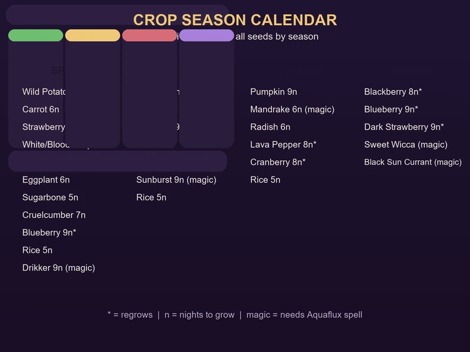
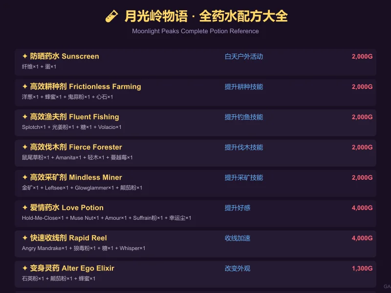
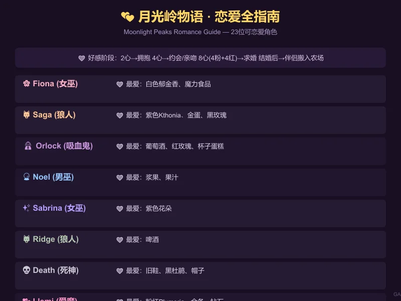
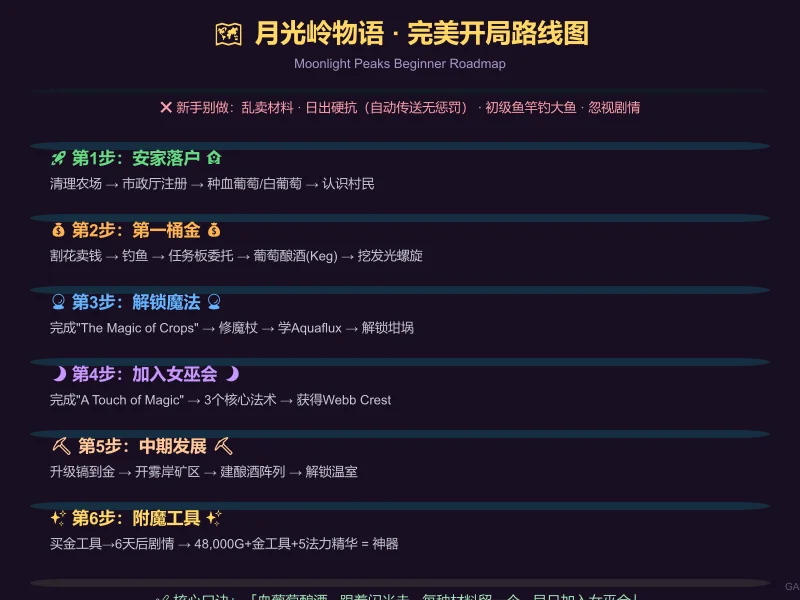

# 🌙 《月光岭物语》(Moonlight Peaks) 完全攻略指南

> 你是一觉睡了五百年的吸血鬼，来到月光岭镇开始新的农场生活。种田、钓鱼、挖矿、恋爱、酿酒、施法……在这款2026年最受关注的魔幻农场模拟游戏中，什么才是正确的开局姿势？本攻略一站讲透。

---

## 一、游戏基础信息

| 项目 | 内容 |
|------|------|
| 英文名 | Moonlight Peaks |
| 中文名 | 月光岭物语 |
| 发售日 | 2026年7月7日 |
| 平台 | PC (Steam) / Nintendo Switch / Switch 2 / Google Play Games (Android) |
| 开发商 | Little Chicken |
| 发行商 | XSEED Games / Marvelous |
| 类型 | 农场模拟 / 生活模拟 / 角色扮演 |
| 最大特色 | 吸血鬼主角 × 魔幻世界观 × 超自然种田 |

你扮演德古拉公爵的孩子——一个厌倦了古堡生活的年轻吸血鬼，来到月光岭镇开始务农生活。唯一的铁律：**日出前必须回到棺材里**。但随着游戏深入，你将学会各种魔法、变身、炼药，最终甚至能在阳光下自由行走。

---

## 二、开局七天完美攻略

**Day 1：安家落户**
- 优先**清理农场**杂草树枝，镰刀收割花丛卖钱
- 去 **Town Hall（市政厅）** 注册，Chester 才能帮你售卖农场产品
- 不要急着花光所有钱——留一些买种子
- 优先种 **Blood Grape（血葡萄）**——可重复收获，酿成酒后利润极高

**Day 2-3：认识村民**
- 每天和遇到的 NPC 打招呼，初期友好度很重要
- 跟随地图上的**闪光点**——触发剧情的位置
- 完成 Luna 给予的基础任务
- 探索农场周边，收集野生资源

**Day 4-5：扩展生产**
- 攒钱买更多种子，尤其是 White Grape（白葡萄）
- 建造储物箱和基础工作台
- 注意查看信箱——很多任务和配方通过信件触发

**Day 6-7：第一桶金**
- 将收获的葡萄制成 Juice → Wine，放在 Keg（酿酒桶）中发酵
- 地里的发光螺旋处可挖掘——可能挖到钻石（2,000G）或稀有配方
- **切记每种材料先留1-2个**再卖——你永远不知道什么时候需要它来炼药或完成任务

**核心原则：** 月光岭的许多核心功能（魔法、炼药、变身）都通过剧情逐步解锁，不是有钱就能马上开通的。**前期别急着扩张，先把现有资源吃透。**

---

## 三、全季节作物指南

月光岭有四季轮换（春→夏→秋→冬），每个季节都有独特作物：

- **🌸 春季**：鬼蒜 Ghost Garlic（4天）、血萝卜 Blood Radish（5天）、影菠菜 Shadow Spinach（6天 ⭯）、女巫黄油菇 W.B.Mushroom（7天）、银铃兰 Silver Bell Orchid（8天）
- **☀️ 夏季**：地狱火椒 Hellfire Pepper（7天）、暮光瓜 Twilight Melon（9天）、女妖莓 Banshee Berry（5天 ⭯）、光姜 Glow Ginger（5天 🪴）
- **🍂 秋季**：诅咒南瓜 Cursed Pumpkin（7天）、曼德拉草根 Mandrake Root（8天）、吸血鬼葡萄 Vampire Grape（6天 ⭯）、苏芙兰 Suffrain（7天 🪴）
- **❄️ 冬季**：霜咬蕨 Frostbite Fern（6天）、幽灵芽 Spectral Sprout（5天 ⭯）

*图例：⭯ = 可重复收获  🪴 = 草药园限定*

💡 **策略要点**：优先多种可重复收获作物 · 血葡萄/白葡萄酿酒利润最高 · 每种至少留1个备用

---

## 四、魔法系统全解析

魔法是《月光岭物语》区别于传统农场模拟的核心系统。通过完成主线任务**逐步解锁**。

**解锁流程：**
1. 春季完成 Luna 的任务「The Magic of Crops」
2. 前往 **Webb of Wonders** 找 **Sabrina** 修复破损魔杖
3. 学习第一个法术 **Aquaflux I**（自动浇水）
4. 完成 **「Mend it with Magic」** 任务获得坩埚

**核心法术：**
- **Aquaflux I/II/III** — 自动浇水16/48/144块农田
- **Ethereal Hands I** — 自动收获最多32株作物
- **Maturio I** — 瞬间催熟作物
- **Tomorrow's Tears** — 确保第二天降雨
- **Hoisthaven** — 移动建筑物
- **Ethereal Axes/Pickaxes/Shovels** — 自动采集（后期神技）

**加入 Moonlit Coven（月光女巫会）** 是游戏核心里程碑，需要连续使用 Maturio I → Tomorrow's Tears → Hoisthaven。完成后获得 Webb Crest，解锁全部高级内容。

💡 **魔法消耗 MP**，初期法力池很小，别滥用。优先解锁 Ethereal Hands。

---

## 五、炼药系统全攻略

**解锁流程：** 拿到坩埚 → Luna 提供草药园/烘干机/研钵蓝图 → Sabrina 处购买配方

**炼药流程：** 种植草药 → 烘干 → 研磨成粉 → 加材料入坩埚 → 获得药水

**必备药水推荐：**
| 药水 | 效果 | 价格 |
|------|------|------|
| ☀️ **防晒药水**（纤维+蛋） | 白天也能户外活动 | 2,000G |
| 🌾 **高效耕种剂** | 提升耕种技能 | 2,000G |
| 🎣 **高效渔夫剂** | 提升钓鱼技能 | 2,000G |
| 🪓 **高效伐木剂** | 提升伐木技能 | 2,000G |
| ⛏️ **高效采矿剂** | 提升采矿技能 | 2,000G |
| 💕 **爱情药水** | 提升好感 | 4,000G |
| 💜 **法力药水** | 恢复MP | 6,000G |

💡 **核心技巧：** 每种材料至少留1-2个 · 优先购买4款技能药水配方 · 草药晒干后研磨成粉再入锅

---

## 六、钓鱼与采矿

**钓鱼：** 跟随 Noel 剧情线获得鱼竿。初代鱼竿拉不动大鱼影——升级后再来。抖动鱼竿可驱赶小鱼。配合 **Fluent Fishing Tonic** 和 **Rapid Reel Potion** 效率更高。

**采矿：** 完成 **「A Bridge Too Far」** 任务 → 开启 **Misty Shores** → 进入 **Cave of Echoes**。大型矿簇优先（最多6矿石）。金矿需铁镐+人鱼形态。**建议优先升级镐子**，解锁更高级矿石。

**工具升级路线（Howling Hammer）：**
- 生锈→铜：1,000G + 3铜锭
- 铜→铁：4,000G + 3铁锭
- 铁→金：16,000G + 3金锭
- **✨ 附魔工具**（终极）：买金工具后6天触发剧情，48,000G+金工具+5法力精华——**使用不耗体力**

---

## 七、恋爱与婚姻全指南

月光岭有 **23位可恋爱角色**，覆盖吸血鬼、狼人、女巫、人类、美人鱼等种族。

| 阶段 | 解锁内容 |
|------|---------|
| ♥♥（2心） | 可以拥抱 |
| ♥♥♥♥（4心） | 可以约会+亲吻 |
| ♥♥♥♥♥♥♥♥（8心） | 可在约会时求婚 |

**结婚流程：** 8心 → 求婚 → 设置婚礼（至少2天后）→ 买礼服 → 伴侣搬入农场

💡 可同时与多人约会（无惩罚）。婚后可将人类/女巫伴侣转化为吸血鬼。当前版本**无子女系统**。

**重点送礼：**
- **Fiona** → 白色郁金香、魔力食品
- **Saga** → 紫色Kthonia、金蛋、黑玫瑰
- **Orlock** → 葡萄酒、红玫瑰、杯子蛋糕
- **Noel** → 浆果、果汁
- **Sabrina** → 紫色花朵
- **Death** → 旧鞋、黑杜鹃、帽子

---

## 八、高效赚钱路线图

**🟢 前期（春季第一年）：** 收割野花卖钱 → 钓鱼 → 挖发光螺旋（可能出钻石2,000G）→ 血葡萄酿酒 → 任务板委托

**🔵 中期（夏-秋）：** 批量酿造葡萄酒（利润3-5倍）→ 种魔法作物 → 深入挖矿采金 → 完成主线解锁新区域

**🟣 后期（冬季起）：** 附魔工具+大面积魔法作物（零体力消耗）→ 温室全年种植 → 稀有药水批量制作

---

## 九、新手避坑清单

❌ **不要做：**
- 乱卖新材料——每种至少留1-2个
- 日出死命往家跑——自动传送无惩罚
- 初级鱼竿挑战大鱼影——拉不上来
- 忽视剧情——核心功能全部靠剧情解锁

✅ **应该做：**
- 第一周目标：完成任务+攒钱买血葡萄/白葡萄
- 每天和村民说话
- 跟随地图闪光点触发新剧情
- 优先升级镐子
- 多个酿酒桶同时运作
- 解锁魔法后尽快加入女巫会
- 防晒药水常备

---

## 📌 核心口诀

> **「血葡萄酿酒，跟着闪光走，每种材料留一个，早日加入女巫会」**

---

## 🔗 专题指南

如需深入了解某一系统，请查阅以下详细专题页：

| 指南 | 说明 |
|------|------|
| [新手入门指南](beginners-guide.md) | 前10夜生存与发展详解 |
| [作物与 farming 指南](crops-farming.md) | 全作物数据、利润排行、加工路线 |
| [吸血鬼法术与技能](vampire-powers.md) | 魔杖修复、全法术列表、法力管理 |
| [钓鱼与采集](fishing-foraging.md) | 钓鱼、捉虫、采矿全攻略 |
| [NPC与恋爱指南](npc-social.md) | 角色介绍、送礼、结婚流程 |
| [赚钱路线指南](money-making.md) | 各阶段最佳赚钱策略 |
| [工具升级指南](tools-upgrades.md) | 升级路线、价格、附魔详解 |
| [博物馆与诺克图娜](museum-nokturna.md) | 藏品收集与卡牌对战 |
| [烹饪与食谱](cooking-recipes.md) | 全食谱、效果分析、利润对比 |
| [节日与活动](festivals-events.md) | 8大节日攻略、生日日历、年度策略 |

---

*本攻略由 GA站 制作，欢迎转载但请注明出处。*
*游戏版本：Moonlight Peaks 1.0（2026年7月发售）*
*攻略更新时间：2026年7月31日*
