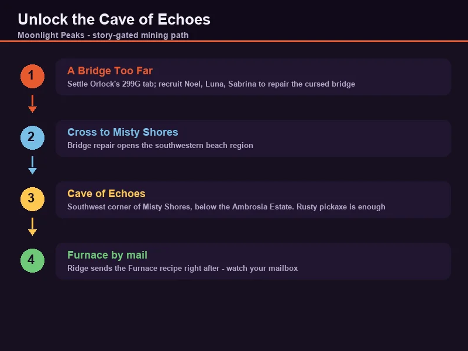
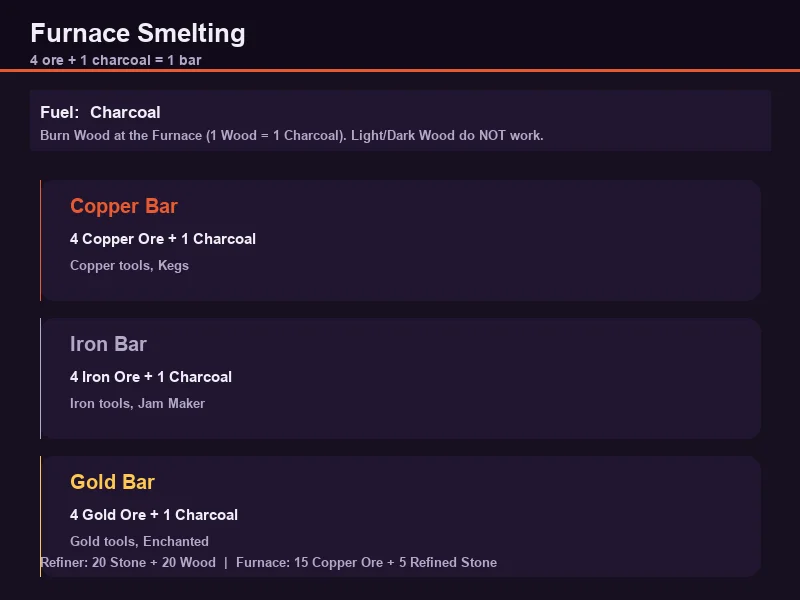
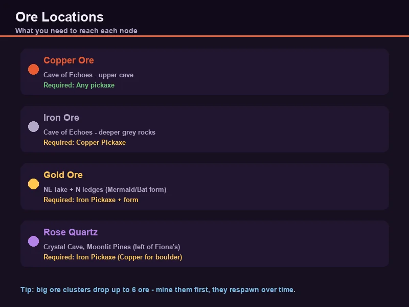
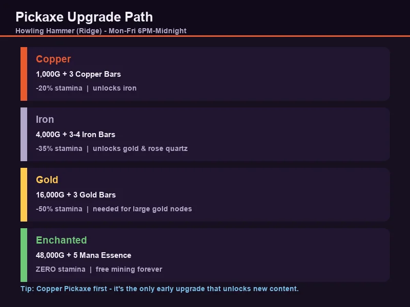

# Moonlight Peaks: Mining & Cave of Echoes Guide

Mining in Moonlight Peaks is gated behind the story, and that's a good thing — the deeper you go, the more the game hands you ways to make it painless. You start with a rusty pickaxe chipping at copper, and by mid-game you're swimming to gold ore as a mermaid and letting an enchanted pickaxe mine for free. This guide covers the full path: unlocking the mine, every ore and where it spawns, smelting, pickaxe upgrades, and the three forms that open up the best ore.

---

## How to Unlock the Mine

You can't just wander into the cave on night one. The mining area is locked behind a multi-step quest chain that opens the **Misty Shores** region.

1. **Start "A Bridge Too Far"** — this is the trigger quest, given after the early town setup. It involves settling Orlock's tab at the bar (299G), then recruiting **Noel**, **Luna** and **Sabrina** to help repair a cursed bridge.
2. **Cross into Misty Shores** — the bridge repair unlocks the southwestern beach area where the mine sits.
3. **Enter the Cave of Echoes** — located in the **southwest corner of Misty Shores**, on the beach below the Ambrosia Estate. A rusty pickaxe is enough to start.

> **Note:** The Furnace recipe arrives by mail from **Ridge**, usually within the first days of spring — often the day after you finish "A Bridge Too Far". Watch your mailbox.

---

## The Furnace & Smelting

Before ore is worth anything, you smelt it into bars. That happens at the **Furnace**, which you craft at a Workbench.

| Item | Recipe | Notes |
|------|--------|-------|
| **Refiner** | 20 Stone + 20 Wood | Unlocks via "A Roof Over Your Head" (give Ridge 50 Wood). Turns 6 Stone → 1 Refined Stone. |
| **Furnace** | 15 Copper Ore + 5 Refined Stone | Smelts ore into bars. |
| **Charcoal** | 1 Wood → 1 Charcoal | Burn Wood at the Furnace. **Only "Wood" works** — Light Wood and Dark Wood do not. Dig spots can also drop it, but unreliably. |

### Bar recipes

| Bar | Recipe | Used for |
|-----|--------|----------|
| **Copper Bar** | 4 Copper Ore + 1 Charcoal | Copper tools, Kegs (30 Wood + 15 Copper Bars) |
| **Iron Bar** | 4 Iron Ore + 1 Charcoal | Iron tools, Jam Maker (40 Wood + 20 Stone + 10 Iron Bars) |
| **Gold Bar** | 4 Gold Ore + 1 Charcoal | Gold tools, Enchanted tool upgrades |

**Smelting tip:** you'll burn through charcoal fast. Cut a dedicated batch of trees each night and process it into charcoal before you need it — nothing stalls a tool upgrade like running out of fuel at 1 AM.

---

## Every Ore and Where to Find It

There are four ores worth collecting, plus a couple of crystal curiosities. Here's the full map.

| Ore | Location | Pickaxe required | What it's for |
|-----|----------|------------------|---------------|
| **Copper Ore** | Cave of Echoes, throughout the upper cave | Any (rusty works) | Copper bars → copper tools, Furnace, Kegs |
| **Iron Ore** | Cave of Echoes, deeper grey/silver rocks | Copper Pickaxe | Iron bars → iron tools, Jam Maker |
| **Gold Ore** | Cave of Echoes — northeast lake area (via Twilight Catacomb) and northern ledges | Iron Pickaxe + Mermaid/Bat form | Gold bars → gold tools, Enchanted upgrade |
| **Rose Quartz** | Crystal Cave in Moonlit Pines, just left of Fiona's House | Iron Pickaxe (Copper Pickaxe to break the boulder blocking the entrance) | Quartz Dust (Enchanted Mortar), gifts for Orlock |
| **Moon Crystal** | Crystal Cave, same cave as Rose Quartz | Iron Pickaxe | Crafting, quest items |

### Gold ore is form-locked

The two things everyone asks about — **gold ore** and **rose quartz** — are both gated by story and transformation, not just pickaxe tier:

- **Gold Ore** sits in the eastern and northern sections of the Cave of Echoes. The eastern deposit is across an **underwater lake** — you need **Mermaid Form** to swim to it. The northern ledge deposit needs **Bat Form** to fly up to it.
- **Rose Quartz** lives in the **Crystal Cave**, but the entrance is blocked by a boulder that needs a **Copper Pickaxe** to smash. The crystal nodes themselves then need an **Iron Pickaxe**.

---

## Pickaxe Upgrade Path

All tool upgrades happen at the **Howling Hammer** (Ridge's shop) in the Ridge, Monday–Friday 6 PM–Midnight. Bring the previous tier plus bars and coins.

| Tier | Cost | Materials | Effect |
|------|------|-----------|--------|
| Rusty → **Copper** | 1,000G | 3 Copper Bars | -20% stamina per swing, unlocks iron |
| Copper → **Iron** | 4,000G | 3–4 Iron Bars | -35% stamina, unlocks gold & rose quartz |
| Iron → **Gold** | 16,000G | 3 Gold Bars | -50% stamina, required for large gold nodes |
| Gold → **Enchanted** | 48,000G | Gold Pickaxe + 5 Mana Essence | **Zero stamina** on every swing |

### Upgrade order I'd recommend

1. **Copper Pickaxe first** — it's the single biggest early unlock, letting you mine iron before anything else.
2. **Copper Axe** — wood is a constant bottleneck for charcoal, Kegs and construction.
3. **Copper Watering Can** — stamina savings on watering add up fast with a 6×6 field.
4. **Then Iron → Gold → Enchanted** on the pickaxe as the story unlocks forms.

> **Why pickaxe-first?** Every other tool upgrade makes a chore slightly easier. The pickaxe is the only one that *unlocks content* — iron, gold, rose quartz, and eventually the free-mine Enchanted tier. It's the best gold-per-stamina spend in the game.

---

## The Three Forms That Open the Mine

The Cave of Echoes is designed to be revisited as you gain forms. Each transformation adds a new corner of the cave.

| Form | Quest to unlock | What it gives you in the mine |
|------|-----------------|-------------------------------|
| **Hellkitten (Cat)** | "The Dinner Party" — a stray spell from Brook turns you into a cat | Faster movement, squeeze into small holes (e.g. a Vampster hidey-hole in the cave), dig sparkly swirls without a shovel |
| **Mermaid (Aqua)** | "A Mermaid's Wish" — after helping Samuel and Kim, Yabbis brews you a potion | Swim the underwater lake to reach the **eastern gold ore**, dive sparkly water ripples for loot |
| **Bat** | "Master of the Night" — restore the Moon, then help drunk Orlock rebuild his Chalice | Fly to **northern ledge gold ore**, interact with glowing windows for items |

**Mermaid form prerequisite chain** (in case you're stuck):
1. "A Curious Passage" — Ludo asks you to investigate the mermaid legend.
2. "The Mysterious Bay" — Samuel reflects on a lost love.
3. "Ludo's Plan" — Ludo and Ridge repair the bridge between Howling Marshes and Luna Bay.
4. "A Mermaid's Wish" — help Samuel propose to Kim; Yabbis brews the potion that gives you legs (and a tail).

Most players land Mermaid form around **autumn of Year 1**, though it varies with how hard you push the story.

---

## Stamina & Efficiency Tips

Mining drains stamina fast, and a full cave run can wreck your whole night. These habits make it painless:

- **Mine big clusters first.** Large ore deposits drop up to **6 ore** per swing-set, regular nodes usually 1. A cluster is worth 4–6 regular nodes for the same stamina.
- **Never mine with a rusty pickaxe once you can help it.** The stamina penalty compounds across a full cave.
- **Keep bars, not ore.** Smelt as you go so tool upgrades never wait on a smelting session.
- **Respawn is your friend.** Ore deposits respawn after a set amount of in-game time — the cave is a renewable income source, not a one-time dig.
- **Bring a snack.** Food buffs that restore or extend stamina turn a half-cave run into a full one.
- **Don't sell copper or iron casually.** Both are needed constantly for tools, Kegs, the Jam Maker, and quests. Excess gold bars, once your tools are done, are the thing actually worth selling.

---

## FAQ

**Q: When can I start mining?**
After "A Bridge Too Far" opens Misty Shores, which is usually within the first couple of weeks of Year 1 spring. The rusty pickaxe is enough for copper.

**Q: Why can't I break that iron rock?**
You need a Copper Pickaxe. Same story for gold (Iron Pickaxe) and the Crystal Cave boulder (Copper Pickaxe).

**Q: How do I get gold ore?**
It's in the eastern and northern Cave of Echoes, both form-locked: Mermaid Form to cross the lake, Bat Form to reach the northern ledge. You'll also need at least an Iron Pickaxe.

**Q: Where is the Crystal Cave?**
In Moonlit Pines, just left of Fiona's House. Smash the boulder with a Copper Pickaxe; the rose quartz and moon crystal nodes need an Iron Pickaxe.

**Q: What's the best first tool upgrade?**
Copper Pickaxe. It's the only early upgrade that unlocks new content (iron) rather than just making a chore faster.

**Q: Does ore respawn?**
Yes — cave deposits respawn after time passes, so the Cave of Echoes is a renewable source of bars.

---

> *Guide prepared for game-guide.club. Game version: Moonlight Peaks 1.0 (July 2026 release). Updated 2026-08-07.*
