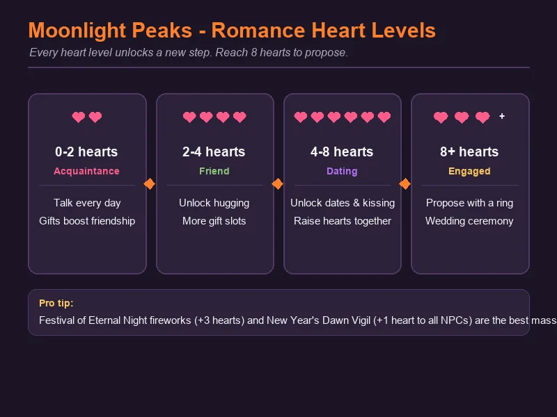
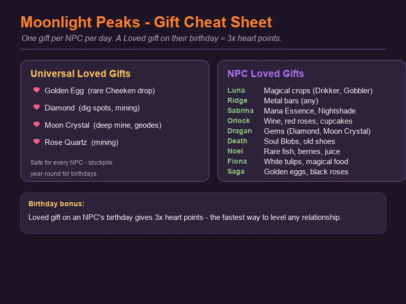
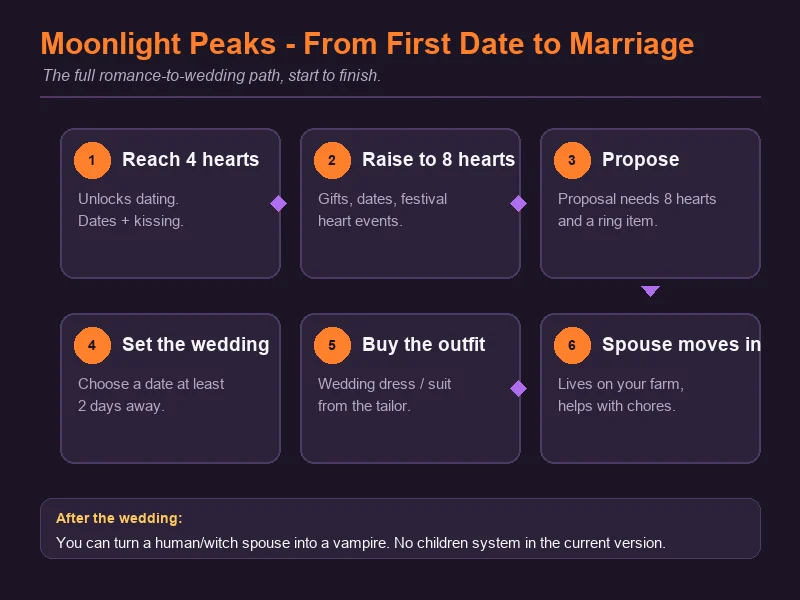

# Moonlight Peaks: NPC, Friendship & Romance Guide

Moonlight Peaks has 23 romanceable villagers — vampires, werewolves, witches, humans and even a mermaid or two. Hearts do most of the work: every villager has a hidden heart level, and raising it unlocks hugs, dates, and eventually marriage. This guide covers the friendship system end to end, including what every villager loves as a gift and how to plan a wedding.

---

## How Friendship Works

Every villager you meet has a heart meter from 0 to 8 (some go higher for special rewards). You raise it three ways:

- **Talk to them** — once per day, a small gain. Cheap, reliable, do it while you're running errands.
- **Give them a gift** — one per day, the biggest lever. Loved gifts are worth much more than liked ones.
- **Show up at festivals** — several festivals hand out heart boosts to everyone, and a few give big boosts to your romance partner.

| Heart range | Relationship | What unlocks |
|-------------|-------------|--------------|
| 0–2 | Acquaintance | Basic friendship. Gifts accepted. |
| 2–4 | Friend | Hugging. Some villagers teach you recipes here (e.g. Sabrina's Hearty Stew at 3 hearts). |
| 4–8 | Dating | Dates and kissing. Lock in your romance choice. |
| 8+ | Engaged | Proposal. Then wedding planning. |

Heart gain is symmetric — villager friendship matters even if you never plan to romance them. High-heart friends teach recipes, send gifts in the mail, and open up dialogue that normal friendship never shows.

---

## The Gift System

### Rules of thumb

- **One gift per villager per day.** That's it. You can't grind a friendship in a single night.
- **Gift quality matters.** A silver or gold-star item is worth more than a normal one, so save your best harvests for people you care about.
- **Loved gifts beat liked gifts by a lot.** A loved gift on a birthday is worth **3×** normal heart points — the single fastest friendship boost in the game.
- **Universal gifts are a safety net.** Some items are loved by literally everyone, which makes them perfect for the Winter festival's Secret Gift Exchange.

### Universal loved gifts

These are safe to give to any villager:

| Gift | Where to get it |
|------|-----------------|
| Golden Egg | Rare drop from a happy Cheeken |
| Diamond | Dig spots, deep mining |
| Moon Crystal | Deep mine floors, geodes |
| Rose Quartz | Mining |

Stockpile these year-round. You never know when a random birthday or the Secret Gift Exchange will demand one.

---

## NPC Gift Quick Reference

| Villager | Loved gifts | Notes |
|----------|-------------|-------|
| **Luna** | Magical crops (Drikker, Gobbler) | Runs the seed stall |
| **Ridge** | Metal bars (any) | Blacksmith, Mon–Fri 6 PM–Midnight |
| **Sabrina** | Mana Essence, Nightshade | Magic shop, Webb of Wonders |
| **Orlock** | Wine, red roses, cupcakes | Wine quest giver |
| **Dragan** | Gems (Diamond, Moon Crystal) | Nokturna |
| **Death** | Soul Blobs, old shoes, black rhododendron, hats | Bug net & Antique Clock quests |
| **Noel** | Rare fish, berries, juice | Fishing quest giver |
| **Fiona** | White tulips, magical food | |
| **Saga** | Purple Kthonia, golden eggs, black roses | |
| **Jada** | Artifacts | Museum curator |

A full birthday calendar with each villager's exact loved gift is below.

---

## Romance Milestones

Hearts drive the romance arc. There's no separate "relationship status" menu — you just cross thresholds.

- **2 hearts** — you can hug. Mostly cosmetic, but it's the first real sign a friendship is warming up.
- **4 hearts** — dating unlocks. You can ask a villager on a date and kiss them. This is the point where the game treats the two of you as a couple.
- **8 hearts** — proposal unlocks. Propose with a ring item and set a wedding date.

Romance gifts aren't always items. Cooking is a strong play: several recipes unlock at specific heart levels and double as great gifts or date meals. Sabrina teaches **Hearty Stew** at 3 hearts and **Shadow Soufflé** at 8 hearts; Luna teaches **Cheeken Pot Pie** at 4 hearts. If you're courting either of them, those recipe unlocks are themselves milestones.

---

## Dating Multiple Villagers

Moonlight Peaks lets you date multiple people at once with no penalty. The game doesn't track jealousy, and there's no "caught dating two people" mechanic — so feel free to raise several candidates to 4+ hearts while you decide.

Two caveats:

- **Dates are a commitment of time.** Each date takes most of a night. Don't overbook yourself during festival weeks.
- **Marriage ends the dating pool.** Once you set a wedding date, the other romances quietly close.

If you're undecided, the **Love Potion** (recipe from the Solstice Soirée, ~4,000g) gives a solid heart boost and helps you push one candidate over the line fast.

---

## Proposal & Marriage

Once you're at 8 hearts with your pick:

1. **Propose.** Give them the proposal ring. They'll accept.
2. **Set a wedding date.** It has to be at least 2 days out — you can't elope the same night.
3. **Buy the outfit.** A wedding dress or suit is required; you can't show up in your farming clothes.
4. **Attend the ceremony.** The whole town shows up. It's one of the best heart-gain nights of the game.
5. **Your spouse moves in.** They live on your farm and help with chores every day.

### What a spouse actually does

- Helps with farm chores daily — watering, feeding animals, occasionally harvesting.
- Has new dialogue and some unique recipe lines tied to their heart level.
- Shows up at festivals with you, which locks in festival partner bonuses.

### Turning your spouse into a vampire

Humans and witches can be converted into vampires after marriage. It's a late-game choice, not a requirement — the main perk is that your spouse stops needing the same daylight restrictions and gains vampire-themed dialogue. Werewolves and other supernaturals are already set.

### Children

The current version has **no children system**. Don't plan your farm layout around a nursery.

---

## Birthday Calendar

Giving a villager their **loved gift on their birthday** is worth **3× heart points**. This is the cheapest, fastest way to push a relationship forward — mark the dates and keep gifts ready.

| Season | Day | Villager | Loved gift |
|--------|-----|----------|------------|
| Spring | 8 | Ridge | Metal bars (any) |
| Spring | 15 | Death | Soul Blobs |
| Spring | 22 | Luna | Magical crop (Drikker, Gobbler, etc.) |
| Spring | 28 | Dragan | Gems (Diamond, Moon Crystal) |
| Summer | 5 | Noel | Rare fish |
| Summer | 12 | Jada | Artifact |
| Summer | 19 | Orlock | Wine (any) |
| Summer | 25 | Sabrina | Mana Essence |
| Fall | 10 | Ridge | Metal bars (any) |
| Fall | 24 | Dragan | Gems (Diamond, Moon Crystal) |
| Winter | 2 | Death | Soul Blobs |
| Winter | 9 | Luna | Magical crop |
| Winter | 16 | Sabrina | Mana Essence |
| Winter | 23 | The Collector | Any museum-quality item |

Note that several villagers celebrate twice a year — Ridge (Spring 8 + Fall 10) and Dragan (Spring 28 + Fall 24) get a second birthday each Fall, and Death, Luna and Sabrina repeat in Winter, always with the same loved gifts. A few villagers don't have fixed birthdays — they've been seen celebrating on random days. Keep a universal loved gift (Golden Egg, Diamond) in your inventory at all times just in case.

---

## Festival Heart Opportunities

Festivals are the best mass-friendship play in the game. Plan around these:

| Festival | When | Heart gain |
|----------|------|------------|
| **Night of First Blood** | Spring 24 | Date your partner; good for pushing romance |
| **Solstice Soirée** | Summer 14 | Love Potion recipe; date with your partner |
| **Harvest Festival** | Fall 16 | Talk to everyone; high attendance |
| **Festival of Eternal Night** | Winter 13 | **Secret Gift Exchange** (loved gift = double hearts) and **fireworks at 11 PM** (+3 hearts with your romance partner) |
| **New Year's Dawn Vigil** | Winter 28 | **Every villager gains +1 heart** — a free round of friendship for showing up |

The Winter festival is the standout: the Secret Gift Exchange + fireworks can push a relationship several hearts in a single night. Bring your best universal loved gift.

---

## Fast-Track Your Romance

A no-fluff checklist for getting married as early as possible:

1. **Talk to your target every single night.** Small, but it stacks.
2. **Stockpile their loved gift** from day one — check the birthday calendar and start hoarding in the right season.
3. **Never miss their birthday.** 3× heart points is the biggest single gain in the game.
4. **Hit the festivals.** Fireworks, Secret Gift Exchange, and the Dawn Vigil's +1-to-everyone are free hearts.
5. **Use the Love Potion** to close the gap when you're a heart or two short.
6. **Prep the wedding early** — ring, outfit, and a date two days out — so the moment you hit 8 hearts you can lock it in.
7. **Keep universal loved gifts on hand** for villagers whose birthdays sneak up on you.

The fastest realistic marriage in Moonlight Peaks is around the first Fall — if you started on your partner's gifts in Spring, took them to every festival, and never missed a birthday.

---

*本攻略由 GA站 制作，欢迎转载但请注明出处。*
*游戏版本：Moonlight Peaks 1.0（2026年7月发售）*
*攻略更新时间：2026年8月2日*
