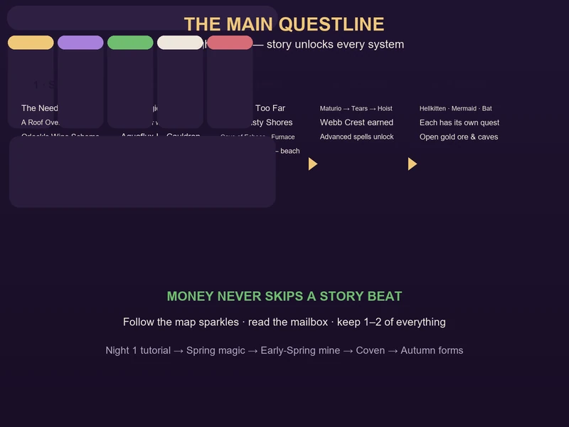
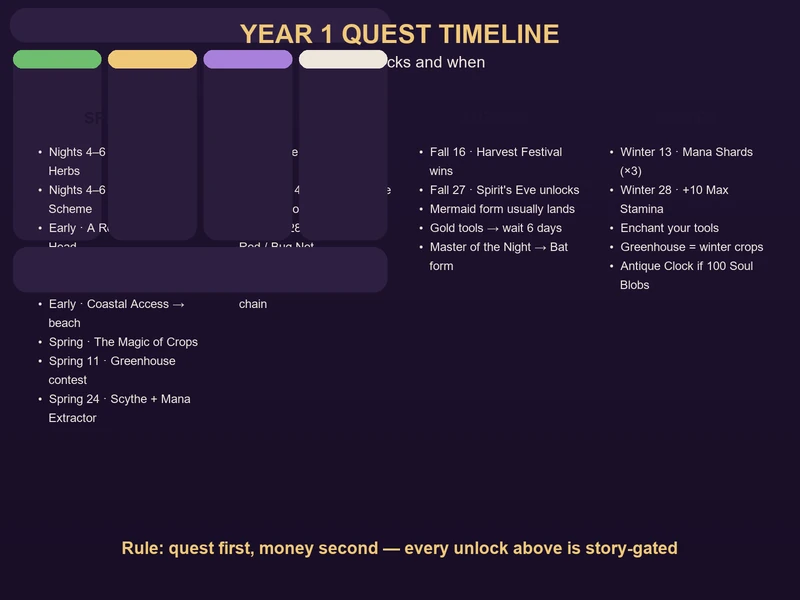
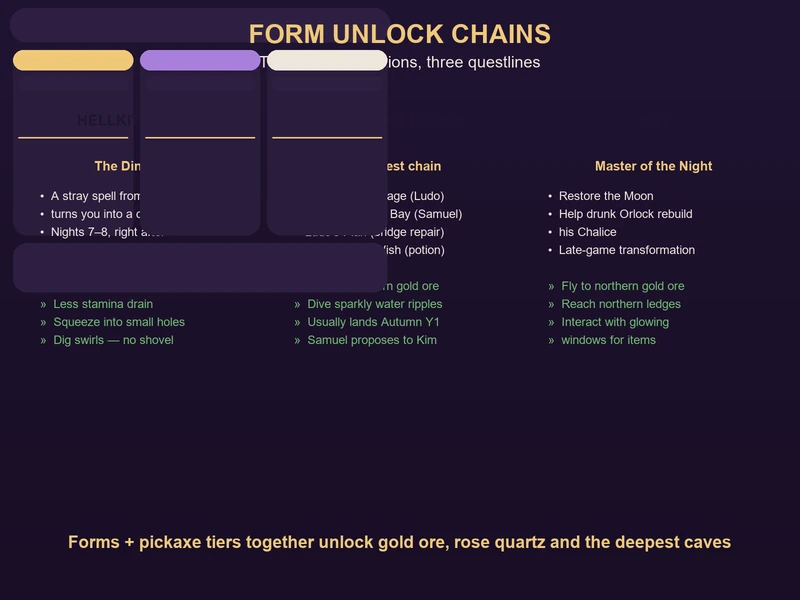
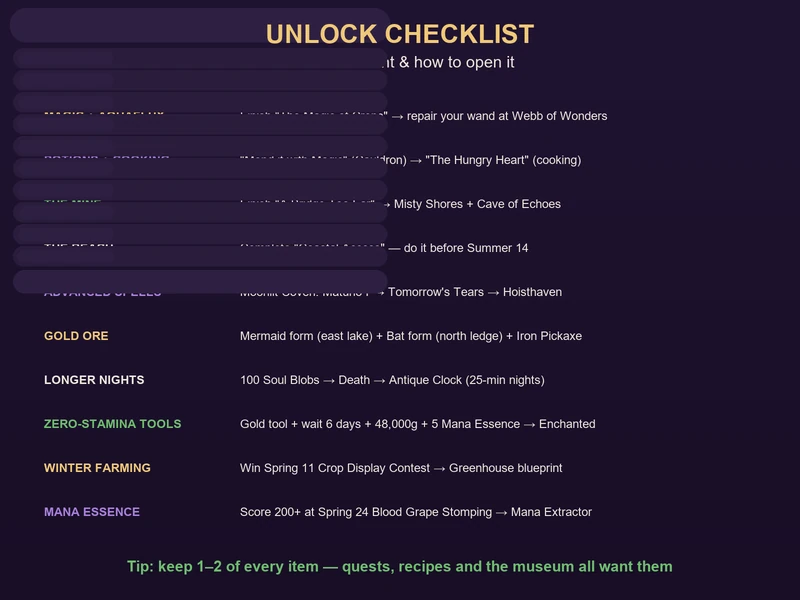

# Moonlight Peaks: Story & Quest Progression Guide

Moonlight Peaks is a farm sim with a catch: almost every serious system is locked behind story quests, and you can't buy your way past them. Want magic? Finish "The Magic of Crops". Want to mine? Complete "A Bridge Too Far". Want a Greenhouse, an Enchanted tool, or the ability to turn into a bat? Each one has a quest or event attached to it. That's a good thing once you know the shape of the game — follow the questline and the whole world opens up in a sensible order.

This guide maps that progression end to end: the early settlement quests, the magic chain, the mine unlock, the Moonlit Coven, all three transformation quests, and the festival milestones that gate late-game content. Every quest name, cost and reward below is tied to the same data used across the [Crop & Farming Guide](crops-farming.md), [Vampire Powers & Spells Guide](vampire-powers.md), [Mining & Cave of Echoes Guide](mining-caves.md) and [Festivals & Events Guide](festivals-events.md).

---

## How the Story Unlocks Work

- **Everything is gated by quests, in a fixed order.** Money lets you buy upgrades faster; it never skips a story beat. The moment you stop chasing the questline, you stop unlocking systems.
- **Follow the map sparkles.** Quest triggers, characters and events show up as glowing spots on the map — the game's way of telling you where the next story beat is.
- **Read the mailbox every night.** Several unlocks arrive as letters: the "Farm Animals for Sale" notice (barn), the Furnace recipe from Ridge, and the Cheese Press blueprint from Luna.
- **Keep 1–2 of everything.** Quests and recipes demand items you'll be tempted to sell — the [Money Making Guide](money-making.md) calls this the second golden rule for a reason.
- **Daily rhythm:** wake at 6 PM, sleep by 6 AM. Most quests can be progressed any night, but festival-linked ones only fire on their date.

---

## Act 1 — Settling In (Nights 1–10)

The first ten nights are the tutorial in disguise: register with the town, repair your farm, and trigger the quests that hand you the game's core machines.

| Quest / Event | When | What it unlocks |
|---------------|:----:|-----------------|
| **Tutorial** (follow your uncle) | Night 1 | Starter tools, your first 3×3 plot of Wild Potatoes |
| **Register at Town Hall** | Night 1–2 | Chester can sell your produce |
| **"The Need for Herbs"** | Nights 4–6 | Tools, fishing and recipes |
| **"A Roof Over Your Head"** | Early Spring | **Refiner** blueprint (20 Stone + 20 Wood) — give Ridge 50 Wood |
| **"Orlock's Wine Scheme"** | Nights 4–6 | **Keg** blueprint — the most important machine in the game (20 Wood) |
| **"Farm Animals for Sale"** (Luna's letter) | After the roof, ~Day 4 | **Barn** (4,000g from Ridge; needs a cleared 10×6 space, one night to build) |

**Around these nights:**

- **Nights 1–3:** clear the farm, forage everything, plant Wild Potatoes. Follow the map sparkles to meet the cast — Luna (seeds), Ridge (blacksmith), Sabrina (magic) and Orlock (wine).
- **Nights 4–6:** start Orlock's Wine Scheme immediately; the Keg is the bedrock of the whole economy. Begin Copper tool upgrades at the Howling Hammer (1,000g + 3 Copper Bars), **Pickaxe → Axe → Watering Can**.
- **Nights 7–10:** build 3 Kegs and keep them running; save toward the Barn. Buy a **Cheeken (1,200g)** once it's up — eggs feed the cooking economy and fertilizer feeds everything.

> **By Night 10 you should have:** 3 Kegs, a Copper Pickaxe, the Refiner blueprint, and 5,000–10,000g in the bank. The full first-ten-night plan lives in the [Beginner's Guide](beginners-guide.md).

---

## Act 2 — Repairing Your Wand (Magic)

Magic is the system that makes Moonlight Peaks special, and it unlocks through a short, unmissable quest chain in Spring of Year 1.

1. **Complete "The Magic of Crops"** (Luna's quest, Spring Y1). This is the trigger — nothing magical happens until it's done.
2. **Visit Webb of Wonders** and talk to **Sabrina**. She repairs your broken wand, which finally lets you cast.
3. **Learn Aquaflux I** — your first spell and the one you'll use every single night: auto-watering crops with Mana.
4. **Finish "Mend it with Magic"** to earn a **Cauldron** blueprint. This also opens the potion system.
5. **Complete "The Hungry Heart"** (early Summer, talk to Sabrina after the wand repair) — she gives you a basic Cauldron and **unlocks cooking**.

**What to do around these quests:**

- Do "The Magic of Crops" the night it appears — Aquaflux I alone saves dozens of watering clicks per night.
- Beeline for **Ethereal Hands** (auto-harvest up to 32 crops) once the spell list opens; it's the biggest time-saver in the game.
- Buy the four **skill tonics** (Farming, Fishing, Woodcutting, Mining) from Sabrina early — they pay for themselves in faster leveling.
- **Sunscreen Potion** (2,000g) removes the single most annoying constraint of the vampire schedule — grab the recipe early.

The full spell list, Mana management and potion recipes are in the [Vampire Powers & Spells Guide](vampire-powers.md).

---

## Act 3 — The Bridge & the Mine

Mining is the second big region gate, and it's a multi-step quest chain of its own.

### "A Bridge Too Far"

This is the trigger quest that opens the **Misty Shores** region and the **Cave of Echoes**:

1. **Start "A Bridge Too Far"** — given after the early town setup. It involves settling **Orlock's tab at the bar (299G)**, then recruiting **Noel**, **Luna** and **Sabrina** to help repair a cursed bridge.
2. **Cross into Misty Shores** — the bridge repair unlocks the southwestern beach area where the mine sits.
3. **Enter the Cave of Echoes** — southwest corner of Misty Shores, on the beach below the Ambrosia Estate. A rusty pickaxe is enough to start.

> **Watch your mailbox:** the **Furnace** recipe arrives by mail from Ridge, usually within the first days of Spring — often the day after you finish "A Bridge Too Far".

### "Coastal Access"

A separate early quest that unlocks the **beach** east of town. It matters more than it looks: the **Solstice Soirée (Summer 14)** takes place there, and you can't attend without this quest done first. Clear it before Summer 14 or you'll miss the Love Potion recipe and the festival-exclusive Moonlight Anglerfish for the museum.

### The Crystal Cave

Not a quest, but a locked location worth knowing: the **Crystal Cave** in Moonlit Pines (just left of Fiona's House) is blocked by a boulder you smash with a **Copper Pickaxe**. Inside, **Rose Quartz** and **Moon Crystal** nodes need an **Iron Pickaxe**. It's the only source of those crystals, which the museum, quests and Enchanted tools all want.

Full ore locations, smelting and pickaxe tiers are in the [Mining & Cave of Echoes Guide](mining-caves.md).

---

## Act 4 — The Moonlit Coven

The **Moonlit Coven** is the core magic milestone — think of it as graduating from the spell system. Joining unlocks the advanced magic content and is required to keep your spell list growing.

The initiation is a sequence of three specific casts, done in order:

1. **Maturio I** — instantly mature a crop
2. **Tomorrow's Tears** — call rain for the next day
3. **Hoisthaven** — move a building

Complete all three in sequence and you earn the **Webb Crest**, which formally inducts you into the coven and unlocks the advanced spells and content that follow. It's a natural story beat, so it flows out of the main questline rather than feeling like a grind.

---

## Act 5 — Your Forms

Transformation is where Moonlight Peaks' vampire fantasy gets mechanical. There are three forms, each with its own quest chain, and each one opens new content in the mine and around town.

| Form | Quest to unlock | What it gives you |
|------|-----------------|-------------------|
| **Hellkitten (Cat)** | **"The Dinner Party"** — a stray spell from Brook turns you into a cat | Faster movement, lower stamina drain, squeeze into small holes (e.g. a Vampster hidey-hole in the cave), dig sparkly swirls without a shovel |
| **Mermaid (Aqua)** | **"A Mermaid's Wish"** — after helping Samuel and Kim, Yabbis brews you a potion | Swim the underwater lake to reach the **eastern gold ore**, dive sparkly water ripples for loot |
| **Bat** | **"Master of the Night"** — restore the Moon, then help drunk Orlock rebuild his Chalice | Fly to **northern ledge gold ore**, interact with glowing windows for items |

### The Mermaid form prerequisite chain

Mermaid is the most involved — most players land it around **autumn of Year 1**. If you're stuck, work this chain in order:

1. **"A Curious Passage"** — Ludo asks you to investigate the mermaid legend.
2. **"The Mysterious Bay"** — Samuel reflects on a lost love.
3. **"Ludo's Plan"** — Ludo and Ridge repair the bridge between Howling Marshes and Luna Bay.
4. **"A Mermaid's Wish"** — help Samuel propose to Kim; Yabbis brews the potion that gives you legs (and a tail).

### Why the forms matter

The two ores everyone asks about — **gold ore** and **rose quartz** — are gated by story and transformation, not just pickaxe tier. The eastern gold deposit is across an underwater lake (Mermaid form), the northern ledge deposit needs Bat form to reach, and the Crystal Cave's rose quartz needs an Iron Pickaxe on top. Forms and tool tiers are two halves of the same progression.

---

## Festival Milestones That Unlock Content

Beyond the quest chain, the festival calendar gates a surprising amount of permanent content. These are the ones worth planning your whole year around.

| Event | Date | Unlock if you win / attend |
|-------|:----:|----------------------------|
| **Crop Display Contest** | Spring 11 | **Greenhouse Blueprint** (extend the growing season — essential for Winter) |
| **Wand Dueling Tournament** | Spring 24 | **Ethereal Scythe** spell (auto-harvest forage & grass) |
| **Blood Grape Stomping** (score 200+) | Spring 24 | **Mana Extractor** blueprint (30 Stone + 10 Iron Bars) — your endgame Mana engine |
| **Solstice Soirée** (beach) | Summer 14 | **Love Potion recipe**; festival-exclusive **Moonlight Anglerfish** for the museum |
| **Shadow Fishing Tournament** | Summer 28 | **Enchanted Rod** (skip rod upgrades) or **Golden Bug Net** (never breaks) |
| **Harvest Festival** | Fall 16 | **Golden Watering Can** (5×5), **Kitchen Extension** plan, **Legendary Card Pack**, or **Horse Mount** |
| **Spirit's Eve** | Fall 27 | **Wardrobe Expansion** (+5 slots) or **Spirit Lantern** |
| **Festival of Eternal Night** | Winter 13 | **Mana Shards** (permanent +10 Max Mana each, limit 3) from the Night Market |
| **New Year's Dawn Vigil** | Winter 28 | **+10 Max Stamina**, a **Resolution Letter** (+5% Farming/Mining/Fishing/Cooking all next year), and the **Sunrise Painting** |

**Priorities for a Year 1 playthrough:** Greenhouse (Spring 11) → Ethereal Scythe or Mana Extractor (Spring 24) → Love Potion recipe (Summer 14) → Golden Watering Can (Fall 16) → all 3 Mana Shards (Winter 13) → the permanent +10 Max Stamina (Winter 28). Save 15,000–20,000g for the Winter Night Market.

---

## The Rest of the Story-Locked Systems

A few unlocks don't fit neatly into the acts above but are still worth chasing:

- **Bug catching** — unlocks around **Night 12** via Orlock's quest chain to Death. Start collecting **Soul Blobs** the moment it does.
- **Antique Clock** — collect **100 Soul Blobs** and trade them to Death. Every night becomes **25 minutes** long — the single biggest time buff in the game.
- **Cheese Press** — the first time you milk a **Pig Goat** (3,500g) or **Draculamb** (4,500g), Luna mails you the blueprint the next morning.
- **Enchanted tools** — buy a gold tool, wait **6 days**, then complete the follow-up event: **48,000g + the gold tool + 5 Mana Essence** turns it into a **zero-stamina** tool. Do the pickaxe first.
- **Museum & Nokturna** — the museum unlocks by talking to **Jada**, gathering artifacts and clearing the park; the **Nokturna card game** is a separate side loop with its own tournament at the Fall 16 Harvest Festival.
- **Marriage** — the full 8-heart → proposal → wedding chain is covered in the [NPC & Romance Guide](npc-social.md), and it has story beats of its own (including turning a human or witch partner into a vampire after marriage).

---

## Full Quest Timeline

| When | Quest / Event | Unlock |
|:----:|---------------|--------|
| Night 1 | Tutorial | Starter tools, first plot |
| Night 1–2 | Register at Town Hall | Chester sells your produce |
| Nights 2–4 | Meet Luna / Ridge / Sabrina / Orlock | Seed stall, blacksmith, magic shop, wine bar |
| Nights 4–6 | "The Need for Herbs" | Tools, fishing, recipes |
| Nights 4–6 | "Orlock's Wine Scheme" | Keg blueprint (20 Wood) |
| Early Spring | "A Roof Over Your Head" | Refiner blueprint |
| ~Day 4 | "Farm Animals for Sale" letter | Barn (4,000g) |
| Spring Y1 | "The Magic of Crops" | Magic trigger — wand repair → Aquaflux I |
| Spring Y1 | "Mend it with Magic" | Cauldron + potion system |
| Nights 7–8 | "The Dinner Party" | Hellkitten form |
| ~Night 12 | Orlock → Death chain | Bug catching (start Soul Blobs) |
| Early Spring | "A Bridge Too Far" | Misty Shores + Cave of Echoes; Furnace recipe by mail |
| Early Spring | "Coastal Access" | Beach (needed for Summer 14) |
| Early Summer | "The Hungry Heart" | Cooking + basic Cauldron |
| Summer–Autumn | Mermaid chain (4 quests) | Mermaid form |
| Autumn Y1+ | "Master of the Night" | Bat form |
| Story beat | Moonlit Coven initiation | Webb Crest + advanced spells |
| Year-round | Various | Crystal Cave, Museum, Enchanted tools |

---

## What to Prioritize

1. **"The Magic of Crops" the night it appears** — Aquaflux I pays back instantly, and the whole magic tree waits behind it.
2. **"A Bridge Too Far" within the first couple of weeks** — mining funds every tool upgrade after it.
3. **"Coastal Access" before Summer 14** — otherwise you'll miss a whole festival and its Love Potion recipe.
4. **Moonlit Coven initiation as soon as the three spells are available** — advanced spells and content are locked behind it.
5. **The Mermaid chain in the background** — it's long, so start it early and let it progress while you farm; most players finish around Autumn Y1.
6. **Festival prep from Spring** — hoard high-quality crops (one per category) and 15,000–20,000g so the Fall 16 and Winter 13 unlocks are never out of reach.

---

## FAQ

**Q: Can I rush the story with money?**
No. Money speeds up tool and building unlocks, but every system here is gated by a quest or event you have to complete yourself.

**Q: I've repaired my wand — why is the Moonlit Coven not showing up?**
The initiation needs **Maturio I**, **Tomorrow's Tears** and **Hoisthaven**, and you cast them *in sequence*. If you haven't learned all three yet, keep pushing the main questline — they arrive in order.

**Q: What's the quickest way to unlock mining?**
Finish "A Bridge Too Far". Settle Orlock's tab (299G), then recruit Noel, Luna and Sabrina to fix the cursed bridge. The mine opens as soon as the bridge is repaired.

**Q: When does bug catching unlock?**
Around **Night 12**, through Orlock's quest chain to Death. Start collecting Soul Blobs immediately — the Antique Clock needs 100 of them.

**Q: How do I get gold ore?**
It's in the eastern and northern Cave of Echoes, both form-locked: **Mermaid form** to cross the lake, **Bat form** to reach the northern ledge. You'll also need at least an **Iron Pickaxe**.

**Q: Is the Greenhouse really worth it?**
Yes — Winter kills outdoor crops, and the Greenhouse (win the Spring 11 Crop Display Contest) is the difference between a productive Year 1 winter and a dead season.

---

## Related Guides

- [🌱 Crop & Farming Guide](crops-farming.md) — every seed by season and the processing chain
- [🔮 Vampire Powers & Spells Guide](vampire-powers.md) — full spell list, Mana management, coven initiation
- [⛏️ Mining & Cave of Echoes](mining-caves.md) — ore, smelting, forms and pickaxe upgrades
- [🎪 Festivals & Events](festivals-events.md) — full festival calendar and hoarding strategy
- [💰 Money Making Guide](money-making.md) — how to fund every unlock on this page
- [👥 NPC & Romance Guide](npc-social.md) — friendship, gift table and the marriage chain
- [🌙 完全攻略指南](index.md) — the Moonlight Peaks hub

---

*Guide prepared for game-guide.club. Game version: Moonlight Peaks 1.0 (July 2026 release). Updated 2026-08-18.*
