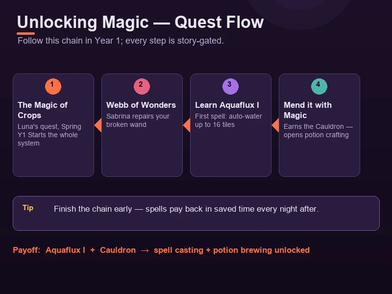
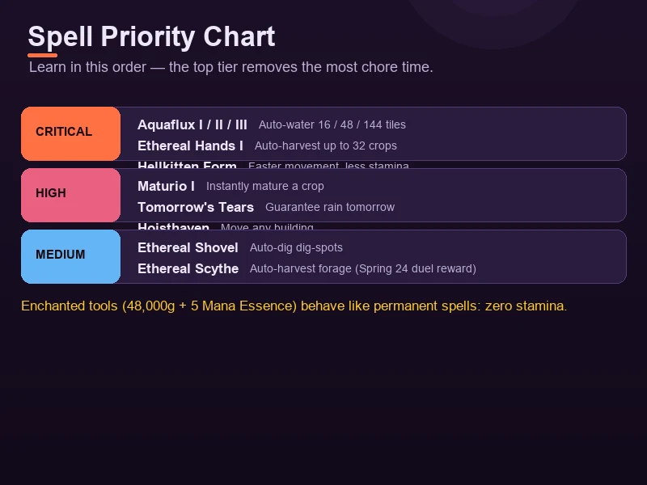
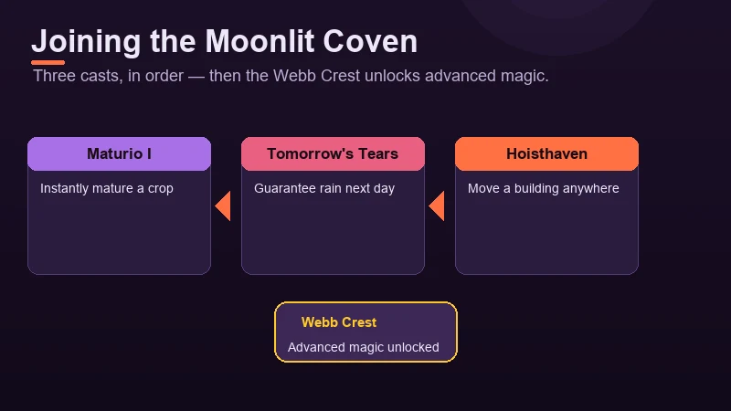
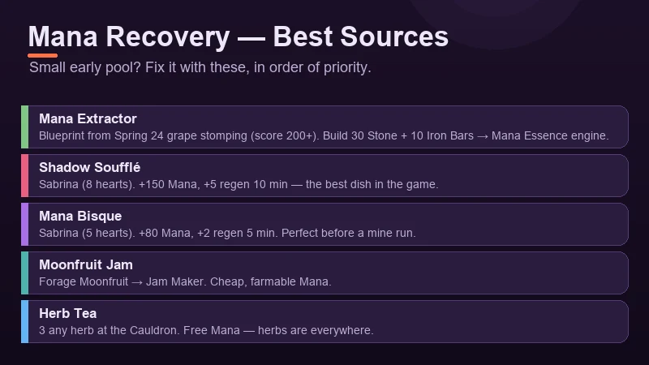

# Moonlight Peaks: Vampire Powers & Spells Guide

Magic is what separates Moonlight Peaks from every other cozy farming sim. You are a vampire, after all — and once your broken wand is repaired, spells quietly become the best quality-of-life tool in the game. Auto-watering, instant crops, moving whole buildings: everything that makes farm chores disappear lives in this one system. This guide covers how magic unlocks, every spell worth learning, how to join the Moonlit Coven, and how to keep your Mana topped up.

---

## How Magic Unlocks

Magic is gated behind the early story, and it unlocks in a fixed order. You can't rush it with money — follow the questline.

1. **Complete "The Magic of Crops"** (Luna's quest, spring of Year 1). This is the trigger — nothing magical happens until it's done.
2. **Visit Webb of Wonders** and talk to **Sabrina**. She repairs your broken wand, which finally lets you cast.
3. **Learn Aquaflux I** — your first spell, and the one you'll use every single night: auto-watering crops with Mana.
4. **Finish "Mend it with Magic"** to earn a **Cauldron** blueprint. This also opens up the potion system, which pairs tightly with spells (covered below).

> **Note:** Sabrina is the character to befriend early — she's the one who sells potion recipes and advances the magic questline, so her friendship level matters for more than just flavor.

---

## Every Spell in the Game

| Spell | Effect | Priority |
|-------|--------|----------|
| **Aquaflux I / II / III** | Auto-water 16 / 48 / 144 farm tiles with Mana | 🔥 Critical |
| **Ethereal Hands I** | Auto-harvest up to 32 crops at once | 🔥 Critical |
| **Maturio I** | Instantly mature a crop | High |
| **Tomorrow's Tears** | Guarantee rain the next day | High |
| **Hoisthaven** | Move a building wherever you want | High |
| **Ethereal Axe** | Auto-chop trees (great for wood runs) | High |
| **Ethereal Pickaxe** | Auto-mine ores — your best friend in the mine | High |
| **Ethereal Shovel** | Auto-dig dig-spots and tilled soil | Medium |
| **Ethereal Scythe** | Auto-harvest forage and grass | Medium |

The spell tiers upgrade as you progress — **Aquaflux** going from 16 to 48 to 144 tiles is the single biggest farming quality-of-life jump in the game. **Ethereal Hands** is worth grabbing as soon as it's available: harvesting 32 crops with one cast turns the morning grind into a two-second cast.

**Two spell-ish upgrades that aren't castable:**
- **Ethereal Scythe** (auto-harvest) is a reward for winning the **Wand Dueling Tournament** at the **Night of First Blood** festival (Spring 24). Enter with a decent spell loadout and it's yours.
- **Enchanted tools** aren't spells, but they behave like one: buy a gold tool, wait 6 days, then complete the follow-up event to enchant it for **48,000g + the gold tool + 5 Mana Essence**. Enchanted tools cost **zero stamina** — effectively permanent spells for your pickaxe, axe and watering can.

---

## Joining the Moonlit Coven

The **Moonlit Coven** is the core magic milestone — think of it as the "graduation" of the spell system. Joining unlocks the advanced magic content, and it's required to keep your spell list growing.

The initiation is a sequence of three specific casts, done in order:

1. **Maturio I** — instantly mature a crop
2. **Tomorrow's Tears** — call rain for the next day
3. **Hoisthaven** — move a building

Complete all three in sequence and you earn the **Webb Crest**, which formally inducts you into the coven and unlocks the advanced spells and content that follow. It's a natural story beat, so it flows out of the main questline rather than feeling like a grind.

---

## Stamina vs Mana: Know Your Resources

Moonlight Peaks runs on two separate energy pools, and confusing them is the most common early mistake.

| | Stamina | Mana |
|--|---------|------|
| **Used by** | Farming, chopping, mining, fishing | Casting spells |
| **Recover via** | Food (any cooked dish) | Mana Extractor, Moonfruit Jam, Nightshade, potions |
| **Starting pool** | Generous enough to get through a night's chores | Small — spend it carefully at first |

Stamina is the classic farm-sim energy bar — eat to refill. **Mana is the one that catches people out**, because your starting pool is tiny and spells feel expensive until you build up Mana-increasing gear and food.

### Best Mana recovery sources

| Source | How to get | Value |
|--------|-----------|-------|
| **Mana Extractor** | Blueprint from the Blood Grape Stomping minigame (score 200+ at Night of First Blood, Spring 24); costs 30 Stone + 10 Iron Bars to build | Converts magical crops into **Mana Essence** — your endgame Mana engine |
| **Moonfruit Jam** | Forage Moonfruit, process at the Jam Maker | Cheap, farmable Mana |
| **Nightshade** | Forage in caves and dark areas | Raw Mana restore on the go |
| **Herb Tea** | 3 any herb at the Cauldron | Free Mana (herbs are everywhere) |
| **Mana Bisque** | Sabrina (5 hearts): 1 Nightshade + 1 fish + 1 milk | +80 Mana and +2 Mana Regen for 5 min — great before a mine run |
| **Shadow Soufflé** | Sabrina (8 hearts): 1 Nightshade + 1 Mana Essence + 2 eggs | +150 Mana and +5 Mana Regen for 10 min — the best Mana dish in the game |
| **Mana Potion** | Brew at the Cauldron | Restores Mana on demand (6,000g) |

> **Rule of thumb:** early on, forage Nightshade and brew Herb Tea — both are free. By summer, build a **Mana Extractor** and keep a stack of Mana Bisque for anything that needs a lot of casting.

---

## Vampire Forms

You're a vampire, and Moonlight Peaks gives you a transformation that's genuinely useful for farm work.

- **Hellkitten Form** — the first form you unlock (around nights 7–8, right after wand repair). It makes you **move faster and drain less stamina**, which adds up over a long night of chores. Unlock it early and you'll never go back.
- After marriage you can also **turn a human or witch partner into a vampire** — a nice bit of flavor for a fully supernatural household.

---

## Potions & Spellcraft

Potion brewing (unlocked alongside the Cauldron from "Mend it with Magic") is where magic and money-making meet. The key recipes:

| Potion | Effect | Recipe price |
|--------|--------|--------------|
| Sunscreen Potion | Do things outdoors in daylight | 2,000g |
| Farming Tonic | Boost farming skill | 2,000g |
| Fishing Tonic (Fluent) | Easier fishing | 2,000g |
| Woodcutting Tonic | Boost woodcutting skill | 2,000g |
| Mining Tonic (Mindless Miner) | Better mining | 2,000g |
| Love Potion | Boost romance gains | 4,000g |
| Mana Potion | Restore Mana | 6,000g |
| Alter Ego Elixir | Change your appearance | — |

The four **skill tonics** (farming, fishing, woodcutting, mining) are the ones worth buying first — they pay for themselves in faster leveling. Grab the **Sunscreen Potion** recipe early too: it removes the single most annoying constraint of the vampire schedule.

---

## Extending the Night

More night = more time to farm, mine and fish. Two ways to stretch it:

- **Antique Clock** — collect **100 Soul Blobs** (a night-only bug catch) and trade them to **Death**. The clock extends each night to **25 minutes** — a permanent, enormous buff.
- **Antique Clock Brew** — a cooking recipe learned from Death at 10 hearts (10 Soul Blobs + 5 Moon Crystal + 3 Gold Bar). It adds **+10 minutes to a single night** as a one-use item.

Soul Blobs are the through-line: start collecting them the moment you unlock bug catching (Orlock's quest chain, around Night 12) and the Antique Clock arrives sooner than you think.

---

## Magic Tips & Tricks

1. **Repair your wand before anything else.** "The Magic of Crops" is a spring quest — do it the night it appears. Aquaflux I alone saves you dozens of watering clicks per night.
2. **Unlock Ethereal Hands early.** Auto-harvesting 32 crops beats manual harvesting in every scenario, and it saves the most time per cast.
3. **Don't hoard spells — spend Mana.** A small starting pool means new players hoard Mana and then never cast. Use Aquaflux nightly; you'll be surprised how fast it pays back in time.
4. **Build a Mana Extractor in summer.** One Mana Extractor turning magical crops into Mana Essence removes Mana as a bottleneck for the rest of the game.
5. **Win the wand duel on Spring 24.** The Ethereal Scythe reward is a permanent auto-harvest for forage and grass — show up with your best spells.
6. **Keep Moonfruit for Jam, not raw sale.** Moonfruit Jam is a Mana source that also sells fine — it's the best two-for-one item for magic mains.
7. **Enchant your tools as the endgame goal.** Zero-stamina gold tools are effectively permanent spells. Save the 48,000g + 5 Mana Essence and do it as soon as you can.
8. **Pair potions with big tasks.** Drink a skill tonic before a dedicated fishing or mining night, and a Mana Bisque before anything that needs heavy casting.

---

## Where to Go Next

Magic pairs with every other system in Moonlight Peaks — magical crops feed your Mana Extractor (see the [Crop & Farming Guide](crops-farming.md)), the [Cooking & Recipes Guide](cooking-recipes.md) lists every Mana food in detail, and enchanted tools belong in the [Tool Upgrade Guide](tools-upgrades.md). For the complete game overview, start from the [Moonlight Peaks comprehensive guide](index.md).
