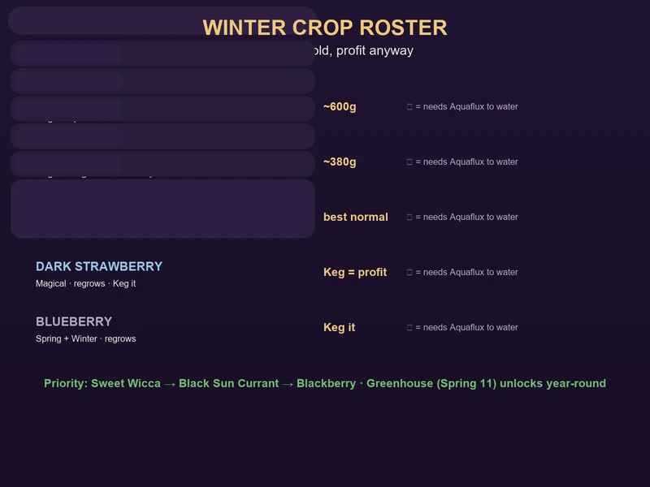
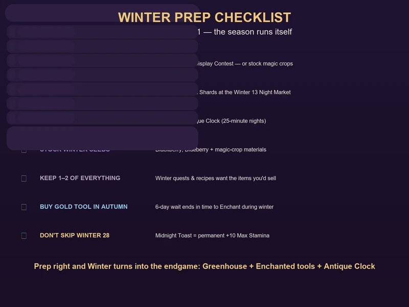

# Moonlight Peaks: Winter Survival Guide

Winter is the season that breaks first-year farmers. Wake up on Winter 1 and every outdoor field is frozen, the town is dark, and the money you were making every night has quietly stopped. It doesn't have to be that way. With a Greenhouse, three magical crops and a plan for the two winter festivals, Year 1 winter is the season where you cement your endgame — not the one where you limp to Spring.

This guide covers everything that changes in winter, the full winter crop roster, the festivals that unlock permanent stat boosts, and the passive-income moves that turn the coldest season into your most profitable one. It's built from the same data as the [Crop & Farming Guide](crops-farming.md), [Festivals & Events Guide](festivals-events.md), [Money Making Guide](money-making.md) and [Story & Quest Guide](quest-story-guide.md).

---

## What Actually Changes in Winter

| System | Winter effect |
|--------|---------------|
| **Outdoor crops** | All non-winter crops **die**. Only winter crops and magic crops survive outdoors. |
| **Foraging** | Field foraging dries up; foraging shifts to **cave items** like Nightshade. |
| **Festivals** | Two events: **Festival of Eternal Night (Winter 13)** and **New Year's Dawn Vigil (Winter 28)**. |
| **Money** | Your spring/summer/autumn cash crops stop paying. Kegs, magic crops and animals carry you. |
| **Upgrades** | Enchanted tools and the Antique Clock unlock around now — the endgame efficiency jump. |
| **Year 2** | On Spring 1, farm debris clears, harder fish spawn and mine floors **41–60** open. |

> **The single biggest lever is the Greenhouse.** Winter kills outdoor farming; the Greenhouse (won at the **Spring 11 Crop Display Contest**) is what lets you keep planting through the cold. If you skipped that festival, winter is the consequence — see the [Festivals & Events Guide](festivals-events.md) for how to win it.

---

## The Winter Crop Roster

Only a handful of crops survive Winter 1–28. The good news: two of them are the game's best profit-per-plant magical crops.

| Crop | Growth | Regrows | Notes |
|------|:------:|:-------:|-------|
| **Blackberry** | 8 days | ⭯ every 2 | Best normal-water winter crop. Runs through the Keg and into desserts. |
| **Blueberry** | 9 days | ⭯ every 3 | Spring + Winter; Keg it like the other berry crops. |
| **Dark Strawberry** ⚡ | 9 days | ⭯ every 3 | Magical; profitable in the Keg. |
| **Sweet Wicca** ⚡ | — | No | Magical; plant near a Hold-Me-Close to make. **~600g per plant** — the top winter earner. |
| **Black Sun Currant** ⚡ | 12 days | ⭯ | Magical; a strong regrowing **Mana crop** worth ~380g per plant. |

*⚡ = requires the **Aquaflux** spell to water. Mushrooms that grow in winter: **Glowhammer** (instant growth) and **Volacio** ⚡ (instant growth, needs Aquaflux) — both Summer/Winter.*

**Priority order for most players:** Sweet Wicca → Black Sun Currant → Blackberry. Sweet Wicca is the headline money crop, Black Sun Currant doubles as your Mana battery, and Blackberry is the reliable normal-water earner for anyone who hasn't unlocked the magic-watering loop yet. Full profit math is in the [Crop & Farming Guide](crops-farming.md).

---

## The Greenhouse Is the Real Winter Win

The Greenhouse blueprint is the prize for winning the **Crop Display Contest** at the Spring Planting Festival (Spring 11). It extends the growing season and is the difference between a productive Year 1 winter and a dead one — the [Story & Quest Guide](quest-story-guide.md) ranks it the single highest-priority Year 1 unlock for a reason.

**How to make winter work without a Greenhouse:**
- Lean on **magic crops** — Sweet Wicca, Black Sun Currant and Dark Strawberry all survive winter and only need Aquaflux to water.
- **Process, don't sell.** Raw Blackberry sells for pocket change; keg it and run it into desserts (Blackberry is a winter dessert ingredient).
- **Keep the Kegs running.** Even grape wine from stored harvests keeps paying while nothing grows.
- **Pivot to mining and fishing.** The Cave of Echoes respawns, and ore income doesn't care about the season. Fishing continues — save your catches to feed Gobbler plants next summer.

---

## Winter Festivals: Two Permanent Boosts

### ❄️ Festival of Eternal Night — Winter 13

The pinnacle of the Moonlight Peaks calendar — an 11-hour night market that runs **4 PM to 3 AM** across the whole town.

| Activity | What you get |
|----------|--------------|
| **Night Market** | Winter-exclusive seeds, furniture, rare crafting materials, and **Mana Shards** (+10 Max Mana each, limit 3). |
| **Secret Gift Exchange** | Give an NPC a loved gift for **double hearts**; receive a random rare item. |
| **Ice Sculpture Contest** | Win the click-timing mini-game for an **Ice Crystal** (craftable furniture) or 5,000g. |
| **Firework Display** (11 PM) | All NPCs attend — bring your romance partner for **+3 hearts**. |

**The move:** save **15,000–20,000g** before Winter 13 and buy all three **Mana Shards** — they're the only source of permanent Max Mana in the game. For the Secret Gift Exchange, hand over a universally loved gift (Golden Egg, Diamond, Moon Crystal, Rose Quartz) — full table in the [NPC & Romance Guide](npc-social.md).

### 🌟 New Year's Dawn Vigil — Winter 28

An overnight town-square event (10 PM–6 AM) that ends Year 1. This one is **mandatory for min-maxers**:

- **Midnight Toast** — permanent **+10 Max Stamina** just for attending. No other way to get it.
- **Year in Review** — all NPCs gain +1 heart.
- **Resolution Letter** — pick **+5% Farming, Mining, Fishing or Cooking** for the entire next year.
- **Dawn Vigil** (stay to 6 AM) — unlock the **Sunrise Painting**, which sells for 15,000g if you don't want it on your wall.

---

## Winter Money-Making

Winter is when passive income stops being optional. Three income lines that carry the season:

1. **Magical winter crops.** Sweet Wicca (~600g/plant) and Black Sun Currant (~380g/plant) are top-5 profit crops in the whole game, and they grow in winter. Scale them with Aquaflux once your Mana pool can handle it.
2. **Enchanted tools.** Buy a gold tool, wait 6 days, then enchant it for **48,000g + the gold tool + 5 Mana Essence** — every swing is **zero stamina**. Do the pickaxe first: free mining is effectively free money because ore respawns.
3. **The Antique Clock.** Collect **100 Soul Blobs** (night-only bug catches, unlock ~Night 12) and trade them to Death. Every night becomes **25 minutes** long — more water, more ore, more fish, more everything. Start collecting the moment bug catching unlocks.

Barn animals (eggs, milk, cheese), fruit trees and beehives keep quietly producing through winter too — a happy herd is a daily income even when the fields are frozen. Full numbers and the recommended spending order are in the [Money Making Guide](money-making.md).

---

## Winter Prep Checklist

Do these **before** Winter 1, and the season runs itself:

- [ ] **Win the Greenhouse** (Spring 11 contest) or bank enough magic crops to survive without it
- [ ] **Save 15,000–20,000g** for the Winter 13 Night Market (Mana Shards ×3)
- [ ] **Hoard Soul Blobs** from Night 12 onward — you need 100 for the Antique Clock
- [ ] **Stockpile winter seeds** (Blackberry, Blueberry) and magic-crop materials
- [ ] **Keep 1–2 of everything** — winter quests and recipes demand items you'll be tempted to sell
- [ ] **Buy a gold tool in autumn** so the 6-day wait ends in time to enchant it during winter
- [ ] **Don't sleep through Winter 28** — the +10 Max Stamina is a permanent, one-time boost

---

## Winter NPC Birthdays

Giving an NPC their loved gift on their birthday is worth **3× heart points**. Four birthdays land in winter:

| Day | NPC | Loved Gift |
|:---:|-----|-----------|
| Winter 2 | **Death** | Soul Blobs |
| Winter 9 | **Luna** | Magical Crop (Drikker, Gobbler, etc.) |
| Winter 16 | **Sabrina** | Mana Essence |
| Winter 23 | **The Collector** | Any Museum-quality item |

Keep loved gifts in your inventory year-round — the [NPC & Romance Guide](npc-social.md) has the full gift table and the universal loved-gift list.

---

## The Year 1 → 2 Transition

The New Year's Dawn Vigil ends Year 1. On **Spring 1 of Year 2**:

- All farm debris is cleared
- New craft recipes become available from NPCs
- **Harder fish** spawn in every location
- Mine deep floors **41–60** unlock

That's the reward for surviving winter properly: a Year 2 that starts with the Greenhouse, an Enchanted pickaxe, the Antique Clock and +10 Max Stamina — which is exactly the setup the [Money Making Guide](money-making.md) recommends for reaching the 100,000g+ endgame.

---

## FAQ

**Q: Do I lose all my crops on Winter 1?**
Outdoor non-winter crops die. Winter crops and magic crops survive, and the Greenhouse keeps everything else alive. Harvest what you can before the season flips.

**Q: I never won the Greenhouse. Is winter a write-off?**
No. Sweet Wicca, Black Sun Currant and Dark Strawberry all survive winter and only need Aquaflux to water. Pivot to Keg processing, mining and the winter festivals — you'll still come out ahead.

**Q: How do I make Sweet Wicca?**
It's a magical winter crop — plant it near a Hold-Me-Close to make. It needs Aquaflux to water and sells for ~600g per plant, the best winter earner.

**Q: What should I spend my Night Market savings on?**
Mana Shards first — all three, +10 Max Mana each, and there's no other source. Winter-exclusive seeds and rare crafting materials after that.

**Q: Is the New Year's Dawn Vigil really mandatory?**
For any min-maxer, yes. The Midnight Toast gives a permanent **+10 Max Stamina** and the Resolution Letter adds +5% to a skill all year. Skip it and both are gone forever.

**Q: What unlocks in Year 2?**
Harder fish, new recipes, mine floors 41–60, and — if you prepped well — a winter-proven farm that turns Spring 1 into a sprint.

---

## Related Guides

- [🌱 Crop & Farming Guide](crops-farming.md) — every seed by season, profit math and the processing chain
- [🎪 Festivals & Events](festivals-events.md) — full festival calendar, hoarding strategy and NPC birthdays
- [💰 Money Making Guide](money-making.md) — how to fund the Greenhouse, Mana Shards and Enchanted tools
- [📖 Story & Quest Guide](quest-story-guide.md) — where the Greenhouse, Antique Clock and Enchanted tools fit in the questline
- [👥 NPC & Romance Guide](npc-social.md) — the universal loved gifts for the Secret Gift Exchange
- [🌙 完全攻略指南](index.md) — the Moonlight Peaks hub

---

*Guide prepared for game-guide.club. Game version: Moonlight Peaks 1.0 (July 2026 release). Updated 2026-08-25.*
